# Informe Forense "Caso Murciélago"

## Análisis de Memoria, Disco y Triaje

- **Asignatura:** Introducción a la práctica forense
- **Caso:** análisis correlado de memoria RAM, imagen de disco y triaje forense
- **Sistema analizado:** IEWIN7 - Windows 7 SP1 x64
- **Usuario principal observado:** IEUser
- **Evidencias originales:** EV-01 (`ram-001.raw`) y EV-02 (`IE11-Win7-VMWare-disk1-002.vmdk`)
- **Fecha de redacción:** 2026-05-05 UTC
- **Criterio de elaboración:** documento estructurado conforme a los campos mínimos del temario y a la referencia a UNE 197010:2015 señalada en la documentación de la asignatura y en la aclaración del profesor

---

## Índice de contenidos

1. Resumen ejecutivo
2. Línea de tiempo
3. MITRE ATT&CK
4. TTPs observadas
5. Descripción del incidente y alcance
6. Dispositivos proporcionados y cadena de custodia
7. Trabajos realizados
8. Hallazgos principales
9. IOCs
10. Conclusiones
11. Recomendaciones y plan de acción

---

## Índice de figuras

1. Figura 1. Verificación inicial de integridad de las evidencias EV-01 y EV-02.
2. Figura 2. Perfil y hora de referencia de la imagen RAM.
3. Figura 3. Extracción de hashes locales desde memoria.
4. Figura 4. Resolución del hash NTLM recuperado.
5. Figura 5. Procesos y líneas de comando observadas en RAM.
6. Figura 6. Actividad de consola recuperada en memoria.
7. Figura 7. Conectividad y puertos observados en memoria.
8. Figura 8. Carpeta con documentación sensible y archivo confesional.
9. Figura 9. Descargas y herramientas preparatorias localizadas en el disco.
10. Figura 10. Accesos recientes a documentos financieros.
11. Figura 11. Evidencia de ejecución en Prefetch.
12. Figura 12. Configuración de adquisición lógica con KAPE.
13. Figura 13. Correlación entre Amcache y reputación externa del malware.
14. Figura 14. Borrado de los documentos financieros desde la papelera.
15. Figura 15. Revisión de persistencia simple en `NTUSER.DAT`.
16. Figura 16. Revisión de persistencia simple en `SOFTWARE`.
17. Figura 17. Historial WebCache con navegación externa y referencias locales del caso.
18. Figura 18. Detalle de navegación recuperada con referencia a `mls-software.com/opensshd.html`.

---

## 1. Resumen ejecutivo

El análisis conjunto de la memoria RAM `ram-001.raw` y de la imagen de disco `IE11-Win7-VMWare-disk1-002.vmdk` permitió reconstruir un incidente con indicios consistentes de compromiso del sistema `IEWIN7`, uso de herramientas de acceso remoto y manipulación de documentación sensible almacenada en el perfil del usuario `IEUser`.

En la memoria se aislaron tres hallazgos especialmente relevantes. Por un lado, se recuperaron credenciales locales válidas a partir del volcado de hashes SAM, obteniéndose para `IEUser` el hash NTLM `fc525c9683e8fe067095ba2ddc971889`, cuya resolución en fuentes abiertas devolvió la contraseña `Passw0rd!`. Por otro, se localizó en ejecución el binario `key.exe`, compatible con una herramienta de captura de credenciales. A ello se sumó la presencia de procesos y servicios aptos para acceso remoto o salida de información, entre ellos `sshd.exe` y `hMailServer.exe`, además de una conexión cerrada hacia la IP pública `200.228.36.6`.

La revisión del disco y el triaje posterior confirmaron que no se trató de una actuación improvisada. Desde el 2021-03-19 UTC quedaron rastros de instaladores y componentes asociados a `hMailServer`, `Thunderbird`, `LibreOffice` y `OpenSSH`. Los artefactos `LNK`, `AutomaticDestinations`, `Prefetch`, `Amcache`, `MFT`, `Recycle Bin` y distintos eventos del sistema permitieron relacionar esa preparación con el acceso a documentos financieros concretos, en especial `Plan_de_cuentas.xls` y `CLIENTES DEL BANCO.xls`, ambos ubicados en `C:\Users\IEUser\Documents\Documentacion empresa` y eliminados después de su apertura el 2021-03-23 UTC.

También quedaron indicios claros de actividad anti-forense. En memoria se recuperó el uso de consola para ejecutar `ipconfig`, desplazarse al escritorio y borrar `HashMyFiles.cfg`. Además, el análisis de `Prefetch` mostró la ejecución de `HASHMYFILES.EXE` desde el escritorio e incluyó la referencia directa a `HASHMYFILES.CFG`, lo que encaja con esa secuencia de consulta y eliminación. En el disco, la presencia de `flag2.txt` en la misma carpeta de la documentación sensible reforzó que el objetivo principal eran archivos con extensión `.xls`.

En conjunto, la evidencia apunta a una preparación previa del entorno, a la ejecución reiterada de un binario compatible con keylogger, al acceso a documentación sensible y al borrado posterior de ficheros para reducir la huella local. El informe mantiene separadas las fases de memoria, disco y triaje para facilitar la lectura, aunque las tres forman parte del mismo hilo de compromiso.

---

## 2. Línea de tiempo

**Nota metodológica:** en este informe todas las marcas temporales se expresan en UTC. Cuando una salida no aportaba una referencia temporal suficiente por sí sola, sólo se integró en la cronología después de comprobar su coherencia con artefactos de memoria y ejecución que sí correlacionaban en UTC, como `KEY.EXE` entre `pslist` y `Prefetch`, o `hMailServer.exe` entre memoria, `Prefetch` y `System.evtx`.

| Fecha y hora (UTC)                     | Fuente                            | Evento observado                                                                                | Relevancia                                                                              |
| -------------------------------------- | --------------------------------- | ----------------------------------------------------------------------------------------------- | --------------------------------------------------------------------------------------- |
| 2021-03-19 09:13:08 UTC                | `System.evtx`                     | Instalación del servicio `hMailServer` con inicio automático.                                   | Señala preparación previa del entorno para comunicación o posible salida de datos.      |
| 2021-03-19 10:18:14 UTC                | `LECmd` / `AutomaticDestinations` | Aparición de `Plan_de_cuentas.xls` en `C:\Users\IEUser\Documents\Documentacion empresa`.        | Ubica uno de los documentos sensibles trabajados durante el incidente.                  |
| 2021-03-19 10:19:04 UTC                | `LECmd` / `AutomaticDestinations` | Aparición de `CLIENTES DEL BANCO.xls` en la misma carpeta.                                      | Confirma un segundo documento financiero sensible dentro del mismo conjunto documental. |
| 2021-03-19 10:38:37 UTC                | `Amcache ShortCuts`               | Creación de accesos directos asociados a `hMailServer`.                                         | Refuerza que la herramienta quedó instalada y operativa desde esa fecha.                |
| 2021-03-20 11:32:49 UTC                | `Amcache UnassociatedFileEntries` | Registro de `C:\Users\IEUser\Desktop\key.exe`.                                                  | Primer rastro sólido del malware en el host.                                            |
| 2021-03-23 17:28:39 UTC - 17:29:58 UTC | `Prefetch`                        | Ejecución de `HASHMYFILES.EXE` desde el escritorio, con referencia a `HASHMYFILES.CFG`.         | Encaja con la posterior eliminación manual del fichero de configuración.                |
| 2021-03-23 19:08:10 UTC                | `Prefetch`                        | Octava ejecución registrada de `KEY.EXE`.                                                       | Demuestra actividad reiterada del binario malicioso.                                    |
| 2021-03-23 19:24:35 UTC                | `Volatility imageinfo`            | Hora de referencia de la captura de memoria RAM.                                                | Fija el estado del host durante la fase activa del incidente.                           |
| 2021-03-23 19:24:35 UTC aprox.         | `Volatility consoles`             | Actividad de consola residente en memoria con `ipconfig`, `cd Desktop` y `del HashMyFiles.cfg`. | Muestra reconocimiento básico de red y borrado selectivo de rastro.                     |
| 2021-03-23 22:48:34 UTC - 22:49:18 UTC | `Prefetch` / `System.evtx`        | Nueva actividad de `hMailServer`.                                                               | Indica que el servicio siguió operativo en la misma jornada del incidente.              |
| 2021-03-23 23:07:55 UTC                | `LECmd` / `AutomaticDestinations` | Apertura reciente de `CLIENTES DEL BANCO.xls`.                                                  | Prueba de acceso al contenido antes del borrado.                                        |
| 2021-03-23 23:08:31 UTC                | `LECmd` / `AutomaticDestinations` | Apertura reciente de `Plan_de_cuentas.xls`.                                                     | Sitúa el acceso al otro documento crítico inmediatamente antes de su eliminación.       |
| 2021-03-23 23:08:59 UTC                | `RBCmd`                           | Eliminación de `CLIENTES DEL BANCO.xls` y `Plan_de_cuentas.xls` en la papelera del usuario.     | Evidencia directa de borrado posterior al acceso.                                       |

---

## 3. MITRE ATT&CK

| Táctica                            | Técnica   | Nombre                                 | Evidencia observada                                                                                                                            |
| ---------------------------------- | --------- | -------------------------------------- | ---------------------------------------------------------------------------------------------------------------------------------------------- |
| Discovery                          | T1016     | System Network Configuration Discovery | En memoria se recuperó el comando `ipconfig` desde consola.                                                                                    |
| Command and Control / Ingress      | T1105     | Ingress Tool Transfer                  | La revisión de MFT y artefactos asociados mostró binarios descargados con rastro de origen externo y presencia de instaladores en `Downloads`. |
| Credential Access                  | T1056.001 | Keylogging                             | `key.exe` fue identificado como binario sospechoso, con ejecución repetida y clasificación de tipo keylogger en VirusTotal.                    |
| Collection                         | T1005     | Data from Local System                 | Los artefactos `LNK` y `AutomaticDestinations` evidenciaron acceso a `Plan_de_cuentas.xls` y `CLIENTES DEL BANCO.xls`.                         |
| Lateral Movement / Remote Services | T1021.004 | SSH                                    | Se observó `sshd.exe` en memoria, regla de firewall asociada y puerto 22 abierto.                                                              |
| Defense Evasion                    | T1070.004 | File Deletion                          | Se documentó el borrado de `HashMyFiles.cfg` y la eliminación de los documentos `.xls` del caso.                                               |

---

## 4. TTPs observadas

La secuencia técnica recuperada permite distinguir cuatro momentos bien diferenciados.

**Preparación del entorno.** El 2021-03-19 UTC quedaron instalados o disponibles componentes que no forman parte del uso habitual de un puesto de trabajo orientado a ofimática básica: `hMailServer`, `Thunderbird`, `LibreOffice` y `OpenSSH`. Esta combinación sugiere que el equipo fue acondicionado con antelación para abrir, preparar y eventualmente mover información.

**Ejecución de malware orientado a captura.** El binario `key.exe` aparece en escritorio, queda registrado en `Amcache`, dispone de `Prefetch` propio y acumuló ocho ejecuciones. La evidencia externa aportada mediante VirusTotal lo clasifica como artefacto malicioso de tipo keylogger/troyano. No se observó persistencia simple mediante claves `Run`, por lo que el mecanismo exacto de arranque no quedó totalmente resuelto con el material revisado.

**Acceso y tratamiento de información sensible.** Los documentos financieros de la carpeta `Documentacion empresa` fueron abiertos en fechas muy concretas y después eliminados. `flag2.txt`, localizado en la misma ruta, contiene un mensaje explícito indicando que los archivos filtrados eran `.xls`, lo que encaja con los dos documentos recuperados por nombre y con la actividad reciente de LibreOffice Calc.

**Borrado selectivo y reducción de huella.** El incidente incluyó acciones coherentes con anti-forense: eliminación de `HashMyFiles.cfg`, borrado de los dos `.xls` y desaparición de binarios o ficheros asociados a la actividad. La secuencia no elimina el rastro pericial, pero sí demuestra intención de dificultar la reconstrucción posterior.

En cuanto a exfiltración, la evidencia permite afirmar que el sistema contaba con `OpenSSH` activo, `hMailServer` operativo y al menos una conexión cerrada hacia `200.228.36.6`. Eso sostiene un escenario técnicamente viable de salida de información, aunque con la evidencia disponible no se recuperó el destinatario final exacto ni el contenido transmitido por correo.

---

## 5. Descripción del incidente y alcance

Se investigó un sistema Windows 7 asociado al usuario `IEUser`, identificado como `IEWIN7`, con el objetivo de reconstruir un posible escenario de fuga de información. El trabajo se organizó en dos grandes bloques conectados entre sí: primero, el análisis de la memoria RAM para fijar el estado vivo del equipo; después, el examen de la imagen de disco, completado con triaje y con parsers de Eric Zimmerman para ordenar y correlacionar los artefactos recuperados.

El escenario reconstruido muestra una actuación planificada. Días antes del momento crítico quedaron instaladas o disponibles varias herramientas de soporte para abrir documentos, mantener acceso remoto y preparar posibles canales de comunicación. Más adelante apareció implantado `key.exe`, que fue ejecutado en repetidas ocasiones. Ya en la fase activa del incidente se localizaron credenciales válidas del usuario local, actividad de consola con borrado de rastro, servicios de red operativos y acceso a documentos financieros concretos.

El análisis de memoria aportó la fotografía del sistema en funcionamiento: procesos, cuentas, consola, servicios y conectividad. El análisis de disco y el triaje añadieron la perspectiva histórica: cuándo se preparó el entorno, qué documentos se abrieron, qué se intentó borrar y qué artefactos quedaron como rastro. Aunque la práctica planteaba frentes distintos, ambos terminaron convergiendo en una misma narrativa técnica y por eso se integran en un único informe.

**Alcance del análisis.** Este informe se limita a las dos evidencias originales facilitadas, `ram-001.raw` y `IE11-Win7-VMWare-disk1-002.vmdk`, así como a los artefactos derivados obtenidos a partir de ellas durante el proceso pericial. No se dispuso de capturas completas de tráfico, telemetría EDR, registros de proxy, exportaciones de buzones ni evidencia directa del extremo remoto `200.228.36.6`. Por ello, el informe acredita con solidez la preparación del entorno, la ejecución del malware, el acceso a los documentos y el borrado posterior, pero no permite atribuir con certeza absoluta el mecanismo final de exfiltración ni el destinatario último de los datos.

---

## 6. Dispositivos proporcionados y cadena de custodia

### 6.1 Evidencias originales analizadas

| ID de evidencia | Descripción                                       | Identificador / hash                                                       | Observaciones                                                                       |
| --------------- | ------------------------------------------------- | -------------------------------------------------------------------------- | ----------------------------------------------------------------------------------- |
| EV-01           | Volcado de memoria `ram-001.raw`                  | SHA-256 `A0AD93B20CD9294F9D49947E87675C12159E3D96AE0D3C5A547F232630B0B240` | Evidencia utilizada para el análisis de estado en vivo mediante Volatility.         |
| EV-02           | Imagen de disco `IE11-Win7-VMWare-disk1-002.vmdk` | SHA-256 `60919A3ADC8450FA7E720EE68F6815D2179673C21C1844F198D7E45B38497068` | Evidencia utilizada para análisis lógico con FTK Imager, montaje y triage con KAPE. |

### 6.2 Criterio temporal, trazabilidad y preservación

El análisis se documentó mediante capturas de pantalla, exportaciones de `FTK Imager`, colecciones `Targets` de `KAPE`, salidas parseadas en `Modules`, CSV de apoyo, ficheros de log y otros productos derivados preservados dentro de `Tarea 10\Evidencias`. A efectos de cadena de custodia, todas las horas del presente apartado se expresan en UTC. La fijación temporal se apoyó en marcas preservadas de los propios ficheros del expediente y en la correlación cruzada entre artefactos de memoria, disco y triage.

La coherencia de esta fijación se contrastó de forma cruzada con referencias preservadas del expediente, entre ellas `volatility-imageinfo.png` (`2026-04-27 17:00:57 UTC`), `kape_triage.png` (`2026-04-30 22:19:35 UTC`) y `kape_triage_lecmd_output.png` (`2026-05-02 10:05:54 UTC`). Cuando una captura no muestra el reloj, se empleó la marca temporal del archivo preservado correspondiente en `Evidencias`, ya fuera PNG, CSV, TXT o artefacto extraído, por resultar coherente con esas referencias y con la secuencia general de trabajo.

La primera actuación que se hace constar formalmente en esta cadena de custodia es la fijación hash de las dos evidencias originales, documentada el 2026-04-27 01:10:00 UTC. A partir de ese momento, el trabajo posterior se realizó sobre copias de trabajo, salidas de herramientas y artefactos derivados generados en carpetas controladas del caso. Esos productos derivados no sustituyen la evidencia de origen, sino que materializan su examen técnico y dejan constancia reproducible de cada actuación pericial.

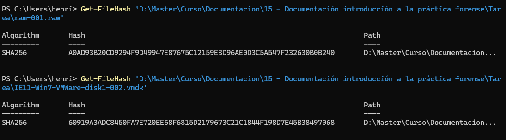

_Figura 1. Cálculo de los hashes SHA-256 del volcado de memoria `ram-001.raw` y de la imagen de disco `IE11-Win7-VMWare-disk1-002.vmdk`, utilizado como punto de partida de la cadena de custodia._

La secuencia fechada aplicada fue la siguiente:

1. `2026-04-27 01:10:00 UTC`: verificación de integridad mediante SHA-256 de `ram-001.raw` y de la imagen `vmdk`.
2. `2026-04-27 15:56:43 UTC` a `2026-04-27 17:00:57 UTC`: explotación analítica de `EV-01` con `Volatility 2.6`, documentando procesos, líneas de comando, consola, hashes locales, conectividad y perfil de memoria.
3. `2026-04-29 19:07:58 UTC` a `2026-04-29 20:18:01 UTC`: revisión controlada de `EV-02` con `FTK Imager`, incluyendo rutas de usuario, `Downloads`, `.ssh`, `Recent`, `Documents` y `Documentacion empresa`.
4. `2026-04-30 22:19:35 UTC`: montaje lógico de la imagen `vmdk` con Arsenal Image Mounter y preparación de la extracción con `KAPE`.
5. `2026-05-02 09:49:58 UTC` a `2026-05-02 11:34:30 UTC`: revisión de productos derivados estructurados con `MFTECmd`, `PECmd`, `LECmd`, `RBCmd`, `WinLogOnView`, `Windows Registry Recovery`, `BrowsingHistoryView` y `Amcache`.
6. `2026-05-05 21:46:55 UTC` a `2026-05-05 21:47:35 UTC`: recuperación final de historial relevante desde `WebCacheV01.dat` y preservación de capturas complementarias.

### 6.3 Actuaciones formales de cadena de custodia

La siguiente tabla se presenta en orden metodológico de custodia. Por ello, la fijación hash de `EV-01` y `EV-02` figura en primer lugar como acto formal de aseguramiento y precede a cualquier explotación analítica posterior del caso.

<!-- markdownlint-disable MD060 -->
| Fecha y hora (UTC) | Actuación formal de custodia | Evidencia o fuente afectada | Producto derivado o soporte preservado |
| ------------------ | ---------------------------- | --------------------------- | -------------------------------------- |
| 2026-04-27 01:10:00 | Cálculo y preservación de los hashes SHA-256 de las evidencias originales `EV-01` y `EV-02`, fijando su identificación inicial antes del inicio del trabajo analítico. | EV-01 / EV-02 | `ram_image_hashes.png` |
| 2026-04-27 15:56:43 a 2026-04-27 17:00:57 | Explotación analítica de `EV-01` con `Volatility 2.6`, documentando `pslist`, `cmdline`, `consoles`, `hashdump`, `netscan` e `imageinfo` como base técnica del análisis de memoria. | EV-01 | `volatility-pslist.png`, `volatility-cmdline.png`, `volatility-cmdline-2.png`, `volatility-consoles.png`, `volatility-consoles-2.png`, `volatility-hashdump.png`, `volatility-netscan.png`, `volatility-netscan-2.png`, `volatility-imageinfo.png` |
| 2026-04-29 19:07:58 | Apertura controlada de `EV-02` en `FTK Imager` y comienzo de la revisión manual de rutas relevantes del sistema y del perfil de usuario. | EV-02 | Repositorio `FTK Imager\` con `$MFT`, `config\`, `Prefetch\`, `Recicle Bin\`, `Roaming_Microsoft_Windows_Recent\`, `webCache\`, `LECmd - output.txt`, `mft_borrados_resumen.csv` y soporte visual `ftk_imager_public_downloads.png` |
| 2026-04-29 19:15:09 | Continuación de la revisión manual de `EV-02`, documentando `.ssh`, `Downloads`, `Documentacion empresa`, `Recent`, `Documents` y el perfil de usuario exportado. | EV-02 | `FTK Imager\IEUser\NTUSER.DAT`, `FTK Imager\webCache\WebCacheV01.dat` y soportes `ftk_imager_ieuser_ssh.png`, `ftk_imager_ieuser_downloads.png`, `ftk_imager_ieuser_documentacion_documentacion_empresa.png`, `ftk_imager_ieuser_microsoft_windows_recent.png`, `ftk_imager_ieuser_documentacion.png` |
| 2026-04-30 22:19:35 | Montaje lógico de la imagen `vmdk` con Arsenal Image Mounter y preparación de la extracción estructurada con `KAPE`. | EV-02 | Repositorio `Triage_Kape\Targets\`, repositorio `Triage_Kape\Modules\`, `2026-04-30T21_31_09_5712827_ConsoleLog.txt` y soporte visual `kape_triage.png` |
| 2026-05-02 09:49:58 | Revisión de productos derivados generados a partir de `EV-02` mediante `MFTECmd`, `PECmd`, `LECmd`, `RBCmd`, `WinLogOnView`, `WRR`, `BrowsingHistoryView` y contraste de `Amcache`. | Derivados de EV-02 | `Triage_Kape\Modules\ProgramExecution\20260430221711_PECmd_Output.csv`, `Triage_Kape\Modules\EventLogs\20260430221700_EvtxECmd_Output.csv`, `Triage_Kape\Modules\Registry\DFIRBatch_RECmdConsoleLog.txt`, `Triage_Kape\20260502132241_Amcache_*.csv`, `Triage_Kape\20260502132416_Amcache_*.csv`, más soportes `kape_triage_mftecmd_output.png`, `kape_triage_pecmd_output.png`, `kape_triage_lecmd_output.png`, `kape_triage_rbcmd_output.png`, `kape_triage_mftecmd_output_2.png`, `winlog_on_view.png`, `browsing_history_view_config.png`, `browsing_history_view_no_result.png`, `wrr_ntuserdat.png`, `wrr_software.png`, `amcache_parser_virus_total_key.exe_malware_family.png`, `amcache_parser_virus_total_key.exe_malware_family_2.png` |
| 2026-05-05 21:46:55 | Recuperación final de historial relevante desde `WebCacheV01.dat` y preservación de capturas complementarias del resultado. | Derivados de EV-02 | `FTK Imager\webCache\WebCacheV01.dat`, `FTK Imager\webCache\V01.log`, `FTK Imager\webCache\V01.chk` y soportes `browsing_history_view_web_cache.png`, `browsing_history_view_web_cache_2.png` |
<!-- markdownlint-enable MD060 -->

Este registro resume la secuencia formal de aseguramiento y explotación de las evidencias originales. En él, el primer acto consignado es la fijación hash de `EV-01` y `EV-02`, pero también se integra expresamente el bloque de análisis de memoria RAM con sus fechas y horas UTC dentro de la propia cadena de custodia.

### 6.4 Registro fechado de productos de trabajo preservados

<!-- markdownlint-disable MD060 -->
| Fecha y hora (UTC) | Actuación documentada | Evidencia o fuente afectada | Producto derivado o soporte preservado |
| ------------------ | --------------------- | --------------------------- | -------------------------------------- |
| 2026-04-27 15:56:43 | Documentación inicial del listado de procesos activos en memoria. | EV-01 | `volatility-pslist.png` |
| 2026-04-27 16:01:47 | Primera captura de `cmdline` para fijar procesos y parámetros relevantes en RAM. | EV-01 | `volatility-cmdline.png` |
| 2026-04-27 16:02:55 | Captura complementaria de `cmdline`, con foco en `key.exe`, `sshd.exe` y `hMailServer.exe`. | EV-01 | `volatility-cmdline-2.png` |
| 2026-04-27 16:04:21 | Preservación de la salida `consoles` con los comandos `ipconfig`, `cd Desktop` y `del HashMyFiles.cfg`. | EV-01 | `volatility-consoles.png` |
| 2026-04-27 16:05:34 | Captura complementaria de `consoles` para completar el contexto de actividad manual en RAM. | EV-01 | `volatility-consoles-2.png` |
| 2026-04-27 16:08:41 | Extracción y documentación de hashes locales mediante `hashdump`. | EV-01 | `volatility-hashdump.png` |
| 2026-04-27 16:17:53 | Contraste externo del hash NTLM recuperado para verificar su resolución textual. | Derivado de EV-01 | `hashes.com-password.png` |
| 2026-04-27 16:48:25 | Segunda comprobación externa del mismo hash NTLM en una fuente independiente. | Derivado de EV-01 | `crackstation.net-password.png` |
| 2026-04-27 16:56:59 | Preservación inicial de la salida `netscan` para fijar puertos, procesos de red y conexión externa. | EV-01 | `volatility-netscan.png` |
| 2026-04-27 16:57:32 | Captura complementaria de `netscan` para completar las filas de conectividad observadas. | EV-01 | `volatility-netscan-2.png` |
| 2026-04-27 17:00:57 | Documentación del perfil sugerido y de la hora de referencia de la memoria mediante `imageinfo`. | EV-01 | `volatility-imageinfo.png` |
| 2026-04-29 18:37:36 | Revisión en FTK Imager de rutas vinculadas a `sshd-server` y elementos asociados a papelera. | EV-02 | `ftk_imager_sshd_server_recycle.png` |
| 2026-04-29 18:51:05 | Revisión en FTK Imager de rutas relacionadas con `sshd-server` y accesos de usuario. | EV-02 | `ftk_imager_sshd_server_send_to.png` |
| 2026-05-02 09:49:58 | Revisión de la salida de `MFTECmd` para documentar huellas del sistema de archivos. | Derivado de EV-02 | `kape_triage_mftecmd_output.png` |
| 2026-05-02 09:51:36 | Revisión de la salida de `PECmd` para confirmar ejecuciones históricas en `Prefetch`. | Derivado de EV-02 | `kape_triage_pecmd_output.png` |
| 2026-05-02 10:05:54 | Revisión de la salida de `LECmd` y `AutomaticDestinations` para documentar accesos a documentos. | Derivado de EV-02 | `kape_triage_lecmd_output.png` |
| 2026-05-02 10:14:38 | Revisión de la salida de `RBCmd` para documentar la eliminación de los `.xls`. | Derivado de EV-02 | `kape_triage_rbcmd_output.png` |
| 2026-05-02 10:37:18 | Segunda revisión de `MFTECmd` para completar la correlación del sistema de archivos. | Derivado de EV-02 | `kape_triage_mftecmd_output_2.png` |
| 2026-05-02 10:51:31 | Consulta de eventos de sesión y actividad de cuentas mediante `WinLogOnView`. | Derivado de EV-02 | `winlog_on_view.png` |
| 2026-05-02 11:00:32 | Configuración de `BrowsingHistoryView` para el examen de `WebCacheV01.dat`. | Derivado de EV-02 | `browsing_history_view_config.png` |
| 2026-05-02 11:02:48 | Primer intento de recuperación de historial web, documentado sin resultados utilizables. | Derivado de EV-02 | `browsing_history_view_no_result.png` |
| 2026-05-02 11:18:24 | Revisión de la colmena `NTUSER.DAT` con Windows Registry Recovery. | Derivado de EV-02 | `wrr_ntuserdat.png` |
| 2026-05-02 11:18:56 | Revisión de la colmena `SOFTWARE` con Windows Registry Recovery. | Derivado de EV-02 | `wrr_software.png` |
| 2026-05-02 11:30:05 | Contraste de `Amcache` con reputación externa del binario `key.exe`. | Derivado de EV-02 | `amcache_parser_virus_total_key.exe_malware_family.png` |
| 2026-05-02 11:34:30 | Captura complementaria del contraste `Amcache` / reputación externa para preservar el contexto completo. | Derivado de EV-02 | `amcache_parser_virus_total_key.exe_malware_family_2.png` |
| 2026-05-05 21:46:55 | Recuperación efectiva de historial relevante desde `WebCacheV01.dat` mediante `BrowsingHistoryView`. | Derivado de EV-02 | `browsing_history_view_web_cache.png` |
| 2026-05-05 21:47:35 | Captura complementaria del historial web recuperado, incluyendo referencia a `mls-software.com/opensshd.html`. | Derivado de EV-02 | `browsing_history_view_web_cache_2.png` |
<!-- markdownlint-enable MD060 -->

Este segundo registro incorpora, también con fecha y hora UTC explícitas, cada salida analítica, captura o artefacto preservado en el expediente técnico. Así se evita que la datación quede sólo sugerida por una imagen y se integra expresamente en el cuerpo del informe la existencia de colecciones extraídas, CSV parseados, hives de registro, logs y repositorios completos de trabajo.

### 6.5 Repositorios y artefactos derivados preservados

<!-- markdownlint-disable MD060 -->
| Repositorio o conjunto preservado | Contenido conservado | Función dentro de la cadena de custodia |
| --------------------------------- | -------------------- | --------------------------------------- |
| `Evidencias\FTK Imager\` | Exportaciones manuales del examen lógico: `$MFT`, `config\`, `IEUser\NTUSER.DAT`, `Prefetch\`, `Recicle Bin\`, `Roaming_Microsoft_Windows_Recent\`, `webCache\`, `LECmd - output.txt`, `mft_borrados_resumen.csv`. | Preserva el subconjunto de artefactos de disco seleccionados durante la revisión manual con FTK Imager. |
| `Evidencias\Triage_Kape\Targets\` | Colección bruta de artefactos extraídos por KAPE: ficheros `.pf`, `.lnk`, `.automaticDestinations-ms`, `.customDestinations-ms`, colmenas `SAM`, `SECURITY`, `SOFTWARE`, `SYSTEM`, `NTUSER.DAT`, eventos `.evtx`, trazas `.etl`, `WebCacheV01.dat`, tareas programadas y repositorio WMI. | Conserva la extracción estructurada de artefactos originales derivados de `EV-02` sobre la que se apoyó el parseo posterior. |
| `Evidencias\Triage_Kape\Modules\` y CSV `Amcache_*` | Resultados parseados por familia: `ProgramExecution`, `EventLogs`, `Registry`, `FileDeletion`, `FileFolderAccess`, `FileSystem`, `SRUMDatabase`, `SUMDatabase`, `SQLDatabases`, además de CSV de `Amcache` y `ConsoleLog.txt`. | Preserva los resultados de análisis ya normalizados y reutilizables para correlación cronológica y búsqueda selectiva. |
| Capturas y soportes visuales `*.png` | Evidencia visual de salidas relevantes de Volatility, FTK Imager, KAPE, WRR, BrowsingHistoryView y contraste externo de hashes y reputación. | Sirve como apoyo visual del expediente, pero no agota por sí sola el conjunto de productos derivados preservados. |
<!-- markdownlint-enable MD060 -->

### 6.6 Artefactos analizados dentro del alcance

| Fuente          | Artefactos principales                                                         | Finalidad dentro del análisis                                                                        |
| --------------- | ------------------------------------------------------------------------------ | ---------------------------------------------------------------------------------------------------- |
| Memoria RAM     | `imageinfo`, `pslist`, `cmdline`, `consoles`, `hashdump`, `netscan`            | Estado en vivo del sistema, procesos, consola, credenciales y conectividad.                          |
| Imagen de disco | `Prefetch`, `Recent`, `.ssh`, `Downloads`, `Documents`, `$Recycle.Bin`, `$MFT` | Ejecución histórica, acceso a documentos, preparación del entorno, borrado y persistencia potencial. |
| Triaje          | `LECmd`, `PECmd`, `RBCmd`, `AmcacheParser`, `WRR`, `WinLogOnView`, `EvtxECmd`  | Correlación temporal, reputación de binarios, eventos y evidencias estructuradas.                    |

Esta cadena de custodia se apoya en tres principios: identificación inequívoca de cada evidencia mediante hash, separación entre evidencia original y productos derivados de análisis, y trazabilidad temporal de las herramientas empleadas en cada fase. En consecuencia, las capturas incorporadas al informe no actúan como prueba aislada, sino como un subconjunto visual de un expediente más amplio que también conserva exportaciones de FTK Imager, colecciones `Targets` de KAPE, salidas `Modules`, CSV parseados, hives de registro, eventos y artefactos de sistema fechados dentro del caso.

Debe quedar expresamente aclarado que herramientas como `Magnet RAM Capture`, `DumpIt` o elementos del maletín forense del analista pertenecen a la fase de adquisición de evidencia. Por tanto, cuando aparecen en disco, en memoria o en artefactos de ejecución, no deben atribuirse por defecto al atacante. En este caso se consideraron parte de la operativa forense y no de la cadena de acciones maliciosas.

---

## 7. Trabajos realizados

### 7.1 Bloque 1: análisis de memoria RAM

Sobre `EV-01` se ejecutaron los plugins `imageinfo`, `pslist`, `cmdline`, `consoles`, `hashdump` y `netscan` de `Volatility 2.6`. El objetivo fue fijar el perfil correcto de la imagen, identificar procesos activos, recuperar línea de comandos, extraer actividad de consola, analizar conexiones de red y obtener credenciales locales.

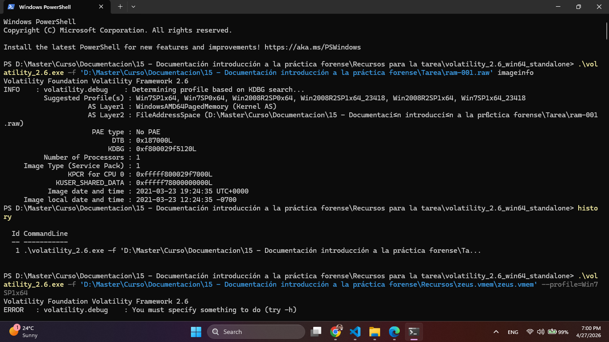

_Figura 2. Salida de `Volatility imageinfo`, donde se identifica el perfil `Win7SP1x64` y la hora de referencia de la imagen de memoria._

El perfil sugerido y empleado fue `Win7SP1x64`, compatible con el sistema observado. La extracción de hashes SAM devolvió varias cuentas locales, entre ellas `IEUser` y `Administrator`, con el mismo hash NTLM `fc525c9683e8fe067095ba2ddc971889`. La resolución de dicho hash en fuentes abiertas permitió obtener la contraseña `Passw0rd!`.

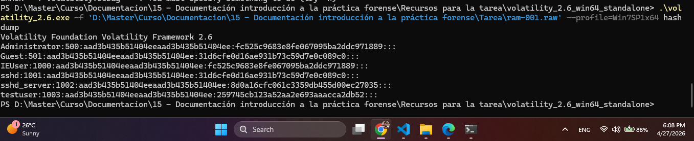

_Figura 3. Salida de `Volatility hashdump` con los hashes locales recuperados, incluyendo `IEUser` y `Administrator`._

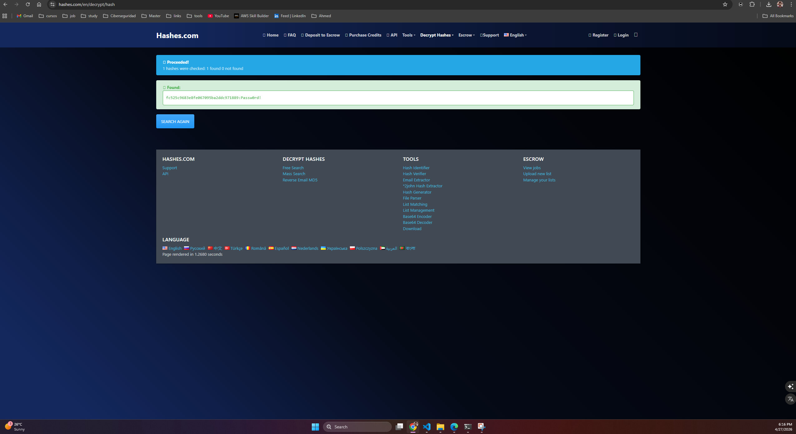

_Figura 4. Evidencia visual de la resolución del hash NTLM `fc525c9683e8fe067095ba2ddc971889` a la contraseña `Passw0rd!`._

En `pslist` y `cmdline` aparecieron, entre otros, `key.exe`, `sshd.exe`, `hMailServer.exe`, `cygrunsrv.exe` y `cmd.exe`. Esa combinación fue relevante porque unió un binario sospechoso de captura de credenciales con un servicio SSH y con un servidor de correo local operando en el mismo host. `netscan` reforzó el hallazgo al mostrar el puerto 22 abierto por `sshd.exe`, los puertos 25, 110, 143 y 587 vinculados a `hMailServer.exe`, y una conexión cerrada hacia la IP pública `200.228.36.6`.

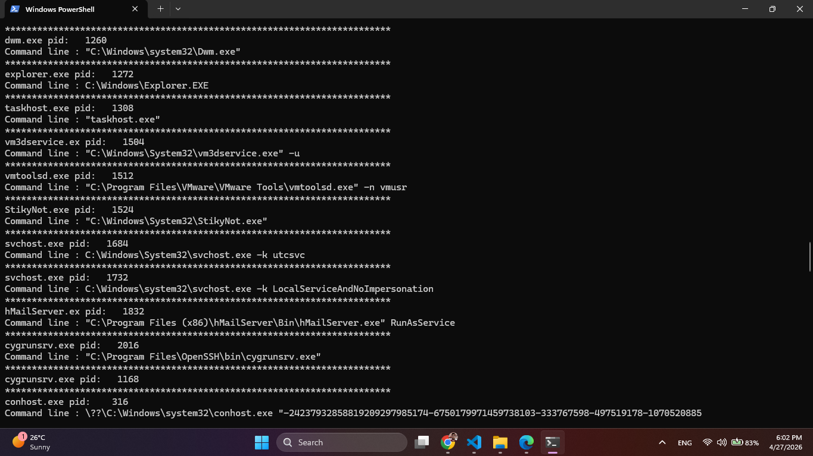

_Figura 5. Salida de `cmdline` donde aparecen `key.exe`, `hMailServer.exe`, `sshd.exe` y otros procesos de interés durante la captura de memoria._

El plugin `consoles` resultó determinante para documentar la actividad manual en consola. En él se recuperaron los comandos `ipconfig`, `cd Desktop` y `del HashMyFiles.cfg`. El primero situó la IP local `192.168.65.135`; los otros dos evidenciaron acceso directo al escritorio del usuario y eliminación selectiva del fichero de configuración de `HashMyFiles`.

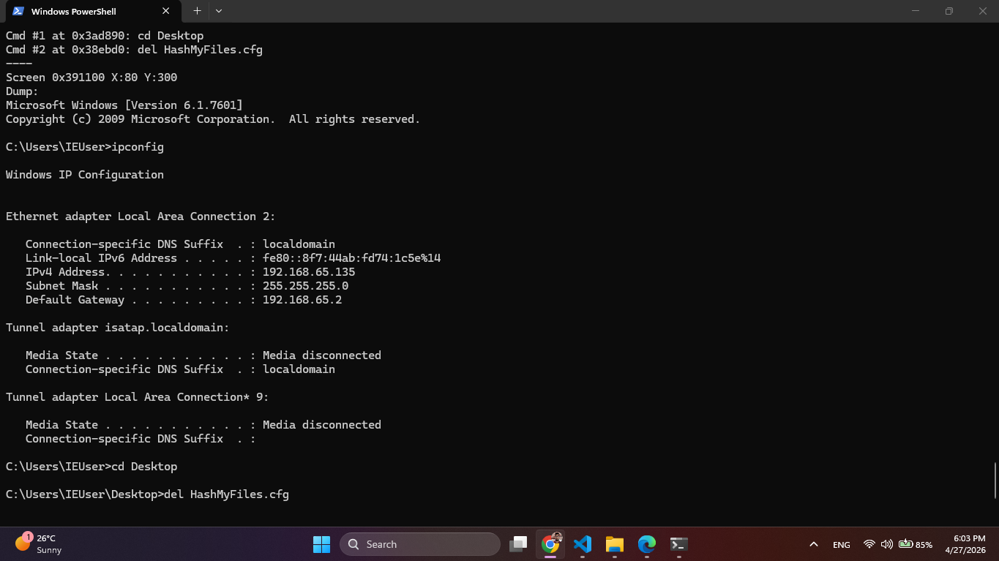

_Figura 6. `Volatility consoles` mostrando la secuencia `ipconfig`, `cd Desktop` y `del HashMyFiles.cfg`._

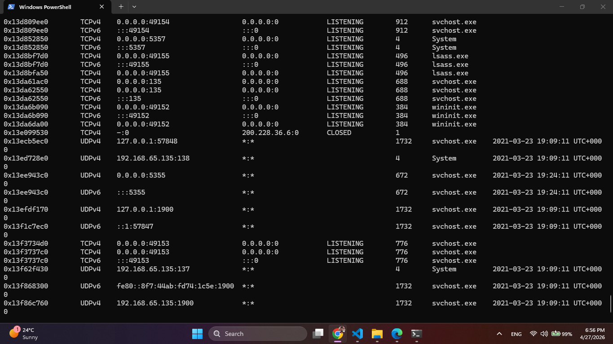

_Figura 7. `Volatility netscan` con presencia de `sshd.exe`, `hMailServer.exe` y conexión cerrada a `200.228.36.6`._

### 7.2 Bloque 2: análisis de la imagen de disco con FTK Imager

Sobre `EV-02` se revisaron manualmente rutas relevantes del perfil de `IEUser`, en especial `Desktop`, `Documents`, `Downloads`, `AppData\Roaming\Microsoft\Windows\Recent`, `.ssh` y `Windows\Prefetch`. Este bloque permitió dar contexto histórico y material a lo que en RAM sólo aparecía como fotografía instantánea.

En `Documents\Documentacion empresa` se encontró `flag2.txt`, cuyo contenido indicaba literalmente que los archivos filtrados eran `.xls`. En esa misma ruta y en artefactos asociados aparecieron los nombres `Plan_de_cuentas.xls` y `CLIENTES DEL BANCO.xls`, ambos coherentes con documentación financiera. La carpeta `Downloads` mostró presencia de instaladores de `hMailServer`, `Thunderbird` y `LibreOffice`, además de una carpeta `malware` ligada al binario sospechoso.

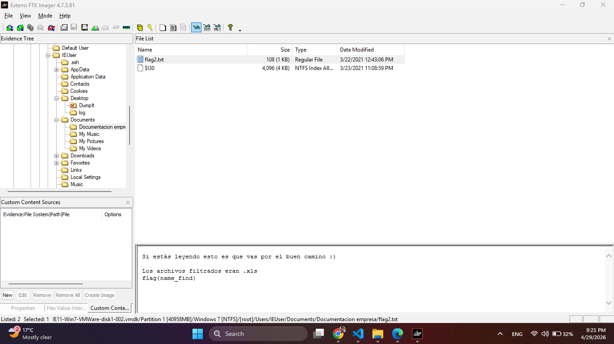

_Figura 8. Vista de FTK Imager sobre `C:\Users\IEUser\Documents\Documentacion empresa`, donde aparece `flag2.txt` en la misma ruta de los documentos sensibles._

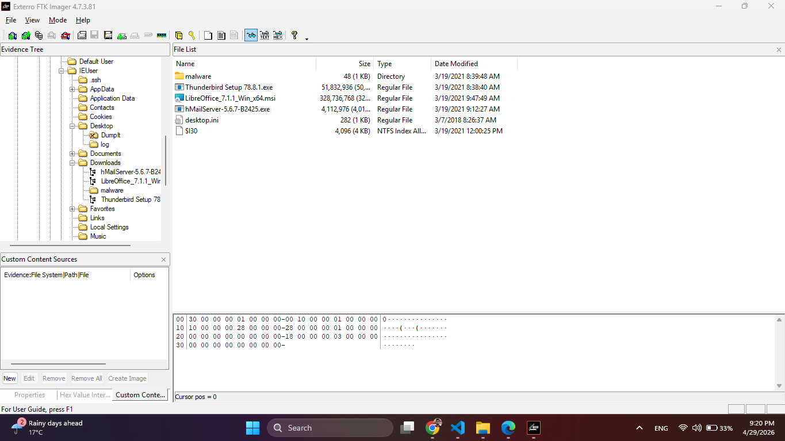

_Figura 9. Vista de FTK Imager sobre `Downloads`, con instaladores y elementos compatibles con la preparación del entorno._

La revisión de accesos recientes con `LECmd` permitió vincular de forma precisa esos documentos con el usuario. Los accesos directos `Plan_de_cuentas.xls.lnk` y `CLIENTES DEL BANCO.xls.lnk` apuntaban a `C:\Users\IEUser\Documents\Documentacion empresa\`. Esto no sólo ubicó los archivos, sino que demostró que fueron abiertos en la jornada del 2021-03-23 UTC.

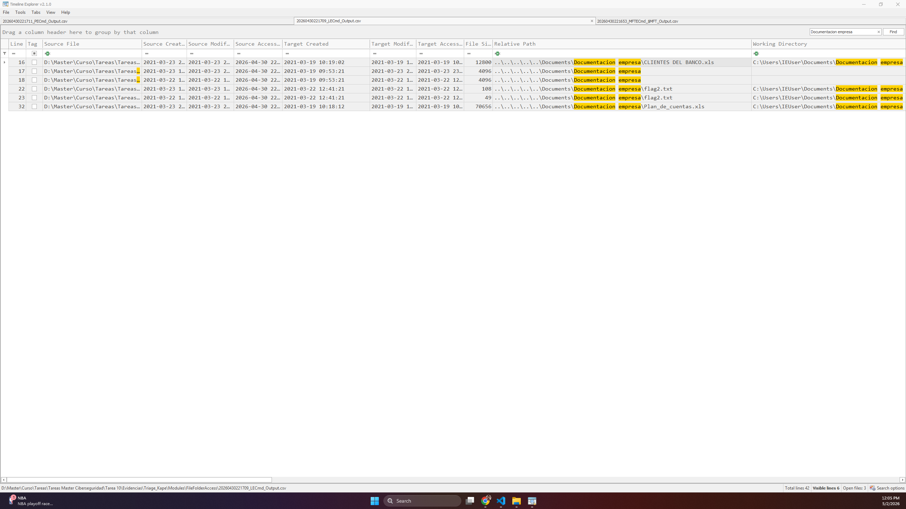

_Figura 10. Salida de `LECmd` en TimeLine Explorer con referencias a `Plan_de_cuentas.xls` y `CLIENTES DEL BANCO.xls`._

En `Prefetch` se localizaron entradas especialmente relevantes: `KEY.EXE-A7310F00.pf`, `HASHMYFILES.EXE-0F3E8D9C.pf` y `HMAILSERVER.EXE-59392E89.pf`. Estas evidencias permitieron afirmar ejecución real y no mera presencia en disco. En particular, el `Prefetch` de `KEY.EXE` registró ocho ejecuciones, mientras que el de `HASHMYFILES.EXE` incluyó como recurso cargado la ruta `\Users\IEUser\Desktop\HASHMYFILES.CFG`, lo que conectó de forma directa con el borrado recuperado en memoria.

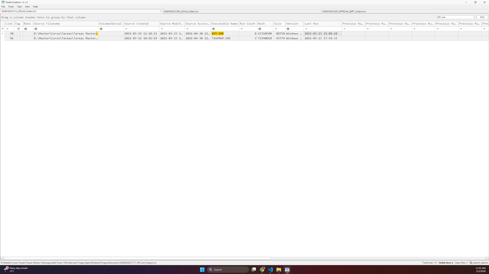

_Figura 11. Salida de `PECmd` que documenta, entre otros, `KEY.EXE`, `HASHMYFILES.EXE` y `HMAILSERVER.EXE`._

### 7.3 Bloque 3: triage con KAPE y parsers de Eric Zimmerman

En una tercera fase se montó lógicamente la imagen y se ejecutó `KAPE` con los targets `!BasicCollection`, `!SANS_Triage`, `WebBrowsers` y `LNKFilesAndJumpLists`, aplicando después el módulo `!EZParser`. Esta fase se utilizó para obtener artefactos de forma estructurada y acelerar la correlación.

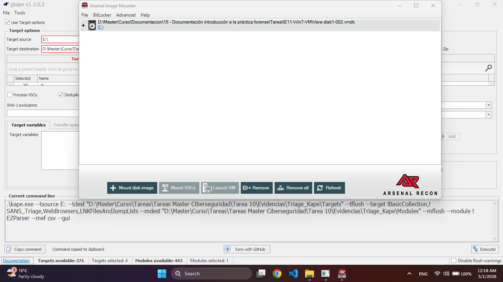

_Figura 12. Ejecución de KAPE sobre la unidad montada derivada de la imagen, utilizada para generar artefactos de trabajo del análisis._

El parser de `Amcache` devolvió una entrada para `c:\users\ieuser\desktop\key.exe`, con tamaño aproximado de 6,43 MB y hash SHA-1 `8ff90488fc3afd7fa7b7a4201890f9d0c4c27ed7`. Con esa referencia se contrastó el binario en VirusTotal, donde figuró con múltiples detecciones como malware de tipo keylogger/troyano.

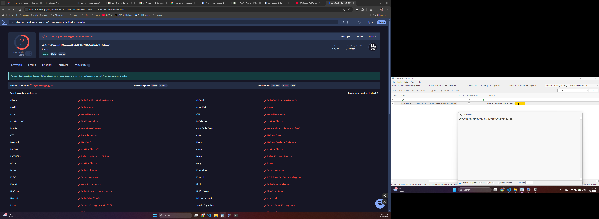

_Figura 13. Evidencia visual del binario `key.exe` y de su clasificación en VirusTotal como artefacto malicioso._

`PECmd` confirmó la ejecución repetida de `KEY.EXE` y la ejecución de `HASHMYFILES.EXE` y `HMAILSERVER.EXE`. `LECmd` y `AutomaticDestinations` confirmaron accesos recientes a `Plan_de_cuentas.xls` y `CLIENTES DEL BANCO.xls`. `RBCmd` demostró que ambos documentos fueron eliminados el 2021-03-23 a las 23:08:59 UTC. Los eventos del sistema y del firewall reforzaron la actividad de `hMailServer` y la presencia de reglas relacionadas con `sshd.exe`.

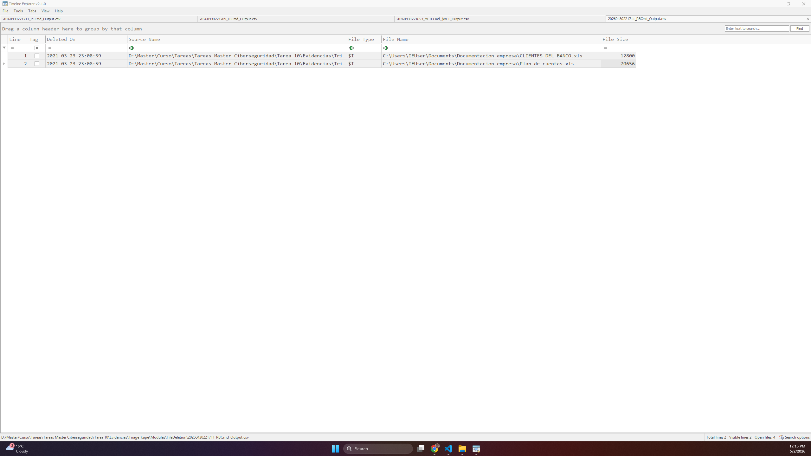

_Figura 14. Salida de `RBCmd` que documenta la eliminación de `CLIENTES DEL BANCO.xls` y `Plan_de_cuentas.xls` a las 23:08:59 UTC._

Adicionalmente se revisaron colmenas de registro (`NTUSER.DAT` y `SOFTWARE`) con el fin de localizar persistencia simple mediante claves `Run`. No se observó un mecanismo concluyente en esas rutas estándar, por lo que se descartó esa vía concreta sin cerrar la posibilidad de otra persistencia más opaca o manual.


_Figura 15. Exploración de `NTUSER.DAT` con Windows Registry Recovery, sin evidencia concluyente de persistencia simple en claves `Run` del usuario._


_Figura 16. Exploración de la colmena `SOFTWARE`, utilizada para descartar persistencia evidente mediante claves `Run` a nivel de sistema._

Como contraste adicional del bloque `WebBrowsers`, se revisó `WebCacheV01.dat` con `BrowsingHistoryView`. Esa revisión no permitió atribuir con certeza la descarga de `key.exe`, pero sí recuperar navegación coherente con la preparación del entorno y con el trabajo sobre artefactos del caso. Entre las entradas visibles figura la URL `http://www.mls-software.com/opensshd.html`, además de referencias locales a rutas y ficheros del entorno de `IEUser`, como `flag2.txt`. Estas marcas se emplean aquí como apoyo contextual y no se incorporan a la línea de tiempo principal en UTC.

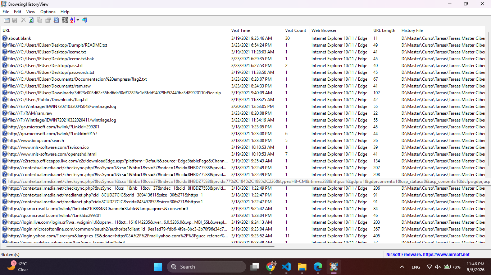

_Figura 17. Resultado de `BrowsingHistoryView` sobre `WebCacheV01.dat`, con historial mixto de URLs externas y referencias locales del perfil `IEUser`._


_Figura 18. Detalle del historial recuperado donde aparece la visita a `http://www.mls-software.com/opensshd.html`, coherente con la preparación previa del componente `OpenSSH` observado en otros artefactos._

### 7.4 Comandos utilizados

Con el fin de dejar trazabilidad técnica suficiente del trabajo reproducible, se incorporan a continuación los comandos efectivamente documentados durante la práctica en `Solucion.md`. Se mantienen como referencia operativa del análisis sobre memoria, disco y triage.

**Volatility 2.6 sobre `EV-01`.**

```bash
.\volatility_2.6.exe -f 'D:\Master\Curso\Documentacion\15 - Documentación introducción a la práctica forense\Tarea\ram-001.raw' imageinfo
.\volatility_2.6.exe -f 'D:\Master\Curso\Documentacion\15 - Documentación introducción a la práctica forense\Tarea\ram-001.raw' --profile=Win7SP1x64 pslist
.\volatility_2.6.exe -f 'D:\Master\Curso\Documentacion\15 - Documentación introducción a la práctica forense\Tarea\ram-001.raw' --profile=Win7SP1x64 cmdline
.\volatility_2.6.exe -f 'D:\Master\Curso\Documentacion\15 - Documentación introducción a la práctica forense\Tarea\ram-001.raw' --profile=Win7SP1x64 consoles
.\volatility_2.6.exe -f 'D:\Master\Curso\Documentacion\15 - Documentación introducción a la práctica forense\Tarea\ram-001.raw' --profile=Win7SP1x64 hashdump
.\volatility_2.6.exe -f 'D:\Master\Curso\Documentacion\15 - Documentación introducción a la práctica forense\Tarea\ram-001.raw' --profile=Win7SP1x64 netscan
```

**Procesado complementario de artefactos de disco.**

```bash
.\LECmd.exe -d 'D:\Master\Curso\Tareas\Tareas Master Ciberseguridad\Tarea 10\Evidencias\FTK Imager\Roaming_Microsoft_Windows_Recent' --all > output.txt
.\MFTECmd.exe -f 'D:\Master\Curso\Tareas\Tareas Master Ciberseguridad\Tarea 10\Evidencias\FTK Imager\$MFT' --csv 'D:\Master\Curso\Tareas\Tareas Master Ciberseguridad\Tarea 10\Evidencias\FTK Imager' --csvf analisis_mft.csv --re "Users\\IEUser"
Select-String -Path ".\analisis_mft.csv" -Pattern ",True," | Select-Object -First 500 > mft_borrados_resumen.csv
```

**Adquisición lógica y parseo estructurado con `KAPE` y `AmcacheParser`.**

```bash
.\kape.exe --tsource E: --tdest "D:\Master\Curso\Tareas\Tareas Master Ciberseguridad\Tarea 10\Evidencias\Triage_Kape\Targets" --tflush --target !BasicCollection,!SANS_Triage,WebBrowsers,LNKFilesAndJumpLists --mdest "D:\Master\Curso\Tareas\Tareas Master Ciberseguridad\Tarea 10\Evidencias\Triage_Kape\Modules" --mflush --module !EZParser --mef csv --gui
.\AmcacheParser.exe -f "D:\Master\Curso\Tareas\Tareas Master Ciberseguridad\Tarea 10\Evidencias\Triage_Kape\Targets\E\Windows\AppCompat\Programs\Amcache.hve" --csv "D:\Master\Curso\Tareas\Tareas Master Ciberseguridad\Tarea 10\Evidencias\Triage_Kape"
```

Estos comandos no sustituyen la descripción analítica de los apartados anteriores, pero sí la refuerzan al dejar constancia explícita de la secuencia técnica aplicada sobre cada conjunto de artefactos.

---

## 8. Hallazgos principales

### 8.1 Recuperación de credenciales locales

Se recuperó el hash NTLM de `IEUser` y se resolvió como `Passw0rd!`. El mismo valor apareció asociado a `Administrator`, lo que evidencia una debilidad importante en la gestión de credenciales y eleva el impacto potencial del incidente. No se trata sólo de un hallazgo técnico: obliga a considerar comprometidas ambas cuentas locales y a tratarlas como tales en cualquier medida de contención.

### 8.2 Ejecución de un binario malicioso compatible con keylogger

`key.exe` apareció activo en memoria, quedó registrado en `Amcache` y generó su propio `Prefetch`, acumulando ocho ejecuciones. La evidencia contrastada en VirusTotal lo clasificó como malware con capacidad de robo de credenciales. La consistencia entre memoria, disco y reputación externa convierte este punto en uno de los hallazgos más sólidos de toda la investigación.

### 8.3 Disponibilidad de acceso remoto y servicios auxiliares

En el momento del análisis estaban presentes `sshd.exe` y `hMailServer.exe`. `netscan` mostró el puerto 22 y los puertos 25, 110, 143 y 587, mientras que el triaje localizó reglas de firewall y eventos del sistema coherentes con ambos servicios. Esto, por sí mismo, no demuestra cada transferencia que pudo haberse realizado, pero sí deja claro que el equipo disponía de medios técnicos suficientes para comunicación remota y posible salida de información.

### 8.4 Acceso a documentación financiera concreta

La revisión del historial web almacenado en `WebCacheV01.dat` añadió contexto útil, aunque no definitivo, sobre la preparación del entorno. En concreto, `BrowsingHistoryView` recuperó una visita a `http://www.mls-software.com/opensshd.html` y varias referencias locales a archivos del perfil de `IEUser`. Este hallazgo no basta para afirmar por sí solo la descarga de `key.exe`, pero sí refuerza que el navegador dejó rastro tanto de componentes vinculados a `OpenSSH` como de archivos relevantes del caso.

### 8.5 Acceso a documentación financiera concreta

Los documentos `Plan_de_cuentas.xls` y `CLIENTES DEL BANCO.xls` quedaron reflejados en `LNK`, `AutomaticDestinations` y `RBCmd`. Ambos estaban ubicados en `C:\Users\IEUser\Documents\Documentacion empresa`. La actividad reciente indica que fueron abiertos el 2021-03-23 UTC y eliminados inmediatamente después. `flag2.txt`, hallado en la misma carpeta, reforzó el enfoque del actor al mencionar expresamente que los archivos filtrados eran `.xls`.

### 8.6 Borrado selectivo de rastro

La acción `del HashMyFiles.cfg` fue recuperada en la consola en memoria. Además, `Prefetch` mostró la ejecución previa de `HASHMYFILES.EXE` y la existencia del propio `HASHMYFILES.CFG` en el escritorio del usuario. En paralelo, `RBCmd` y los artefactos de acceso reciente demostraron el borrado de los dos documentos financieros inmediatamente después de su apertura. Esta secuencia es compatible con una maniobra deliberada para reducir evidencia visible en el sistema. De forma más concreta, el borrado de `HashMyFiles.cfg` eliminó la traza de configuración inmediata dejada por esa utilidad; con la evidencia disponible no puede determinarse qué elementos concretos fueron consultados desde `HashMyFiles`, pero sí que se intentó suprimir ese rastro local después de usarla.

### 8.7 Relación entre memoria y disco

La principal fortaleza del caso no está en un artefacto aislado, sino en la forma en que varias fuentes distintas apuntan a la misma secuencia. La memoria mostró `key.exe`, la actividad de consola, los servicios de red y la conexión externa. El disco permitió entender de dónde venían esos elementos, qué documentos resultaron de interés y qué se intentó borrar después. El triaje, a su vez, ordenó la secuencia temporal y añadió hashes, eventos y accesos recientes. Esa convergencia es lo que da solidez al informe.

---

## 9. IOCs

| Tipo                | IOC                                                                      | Fuente                                    | Significado                                                            |
| ------------------- | ------------------------------------------------------------------------ | ----------------------------------------- | ---------------------------------------------------------------------- |
| Equipo              | `IEWIN7`                                                                 | `Volatility`, artefactos de triage        | Host comprometido bajo análisis.                                       |
| Usuario             | `IEUser`                                                                 | Memoria, disco, eventos                   | Usuario principal vinculado a los documentos y al escritorio afectado. |
| Credencial          | NTLM `fc525c9683e8fe067095ba2ddc971889`                                  | `hashdump`                                | Hash local recuperado de `IEUser` y `Administrator`.                   |
| Credencial resuelta | `Passw0rd!`                                                              | Resolución externa del hash               | Contraseña local asociada al hash NTLM recuperado.                     |
| Malware             | `C:\Users\IEUser\Desktop\key.exe`                                        | `Amcache`, `Prefetch`, memoria            | Binario sospechoso con funcionalidad de keylogger.                     |
| Hash de malware     | SHA-1 `8ff90488fc3afd7fa7b7a4201890f9d0c4c27ed7`                         | `Amcache`                                 | Huella útil para búsqueda retroactiva y bloqueo.                       |
| Servicio remoto     | `C:\Program Files\OpenSSH\usr\sbin\sshd.exe`                             | Memoria, firewall, `RecentFileCache`      | Servicio SSH activo en el equipo.                                      |
| Servicio de correo  | `C:\Program Files (x86)\hMailServer\Bin\hMailServer.exe`                 | Memoria, eventos, `Prefetch`              | Servicio de correo local activo.                                       |
| IP local            | `192.168.65.135`                                                         | `consoles` / `ipconfig`                   | Dirección interna observada durante la sesión.                         |
| IP remota           | `200.228.36.6`                                                           | `netscan`                                 | Destino externo observado en conexión cerrada.                         |
| Puertos             | `22`, `25`, `110`, `143`, `587`                                          | `netscan`                                 | Servicios expuestos o activos durante el incidente.                    |
| Documento sensible  | `C:\Users\IEUser\Documents\Documentacion empresa\Plan_de_cuentas.xls`    | `LECmd`, `AutomaticDestinations`, `RBCmd` | Documento financiero accedido y eliminado.                             |
| Documento sensible  | `C:\Users\IEUser\Documents\Documentacion empresa\CLIENTES DEL BANCO.xls` | `LECmd`, `AutomaticDestinations`, `RBCmd` | Segundo documento financiero accedido y eliminado.                     |
| Huella anti-forense | `HashMyFiles.cfg`                                                        | `consoles`, `Prefetch`                    | Archivo de configuración borrado tras usar `HashMyFiles`.              |

---

## 10. Conclusiones

La evidencia analizada permite sostener, con un grado alto de consistencia técnica, que el sistema `IEWIN7` fue utilizado en un escenario de acceso indebido a información sensible. No se aprecia un hecho aislado ni casual. La preparación previa del entorno, la ejecución repetida de `key.exe`, el acceso a documentos financieros concretos, la actividad de servicios remotos y el borrado posterior de archivos encajan mejor con una secuencia planificada que con un uso normal del equipo.

La memoria aportó la visión del sistema en funcionamiento: procesos, credenciales, consola, servicios y conectividad. El disco y el triaje completaron esa imagen con el contexto histórico: herramientas instaladas, documentos abiertos, rastro de borrado y artefactos complementarios. La relación entre ambos bloques es directa y suficientemente sólida como para integrarlos en un único relato pericial sin perder claridad analítica.

Sobre la base de la evidencia, puede sostenerse que:

1. `IEUser` y `Administrator` compartían una credencial débil y recuperable.
2. `key.exe` se ejecutó en reiteradas ocasiones y es compatible con un keylogger.
3. El host tenía `OpenSSH` y `hMailServer` disponibles y activos en momentos relevantes del incidente.
4. Los archivos `Plan_de_cuentas.xls` y `CLIENTES DEL BANCO.xls` fueron accedidos y eliminados el 2021-03-23 UTC.
5. Se intentó reducir la huella local mediante el borrado de `HashMyFiles.cfg` y de los documentos trabajados.

Con la evidencia disponible no puede precisarse con el mismo nivel de certeza cuál fue el canal exacto por el que salieron los datos ni quién fue su destinatario final. Sí puede afirmarse, en cambio, que existían medios técnicos suficientes para ello y que la IP `200.228.36.6` constituye un indicador externo de especial interés para cualquier continuación de la investigación.

---

## 11. Recomendaciones y plan de acción

Las recomendaciones que siguen se ordenan por prioridad para facilitar su aplicación. Todas derivan de los hallazgos expuestos en el informe y buscan traducir la evidencia técnica en medidas concretas y verificables.

<!-- markdownlint-disable MD060 -->
| Prioridad | Recomendación                                                                                                                                                                   | Recursos necesarios                                                                      | Plazo estimado     | Criterio de éxito                                                                                                  |
| --------- | ------------------------------------------------------------------------------------------------------------------------------------------------------------------------------- | ---------------------------------------------------------------------------------------- | ------------------ | ------------------------------------------------------------------------------------------------------------------ |
| Alta      | Rotar de inmediato las credenciales locales de `IEUser` y `Administrator`, invalidando cualquier reutilización de `Passw0rd!` en otros entornos.                              | Administración de sistemas, acceso al host y política de contraseñas.                    | Menos de 24 horas. | Las credenciales antiguas dejan de autenticar y queda constancia del cambio efectivo.                              |
| Alta      | Segregar la gestión de credenciales locales entre equipos y, si el entorno lo permite, implantar Microsoft LAPS o un control equivalente para evitar reutilización de contraseñas administrativas. | Administración de sistemas, directorio corporativo y política de gestión de identidades. | 24 a 72 horas.     | Cada equipo mantiene credenciales locales diferenciadas y auditables, sin reutilización manual de claves.         |
| Alta      | Aislar o retirar de servicio el host analizado hasta completar una revisión de integridad, dado que existió malware con capacidad de captura de credenciales.                   | Equipo de sistemas, red y respuesta a incidentes.                                        | Menos de 24 horas. | El host deja de tener conectividad con la red de producción y queda bajo contención.                               |
| Alta      | Bloquear y monitorizar la IP `200.228.36.6`, además de revisar si aparece en otros registros corporativos, proxys, firewall o SIEM.                                           | Firewall, SIEM, registros de red y personal SOC.                                         | 24 a 48 horas.     | La IP queda bloqueada y se completa una búsqueda retrospectiva documentada.                                        |
| Alta      | Buscar de forma retrospectiva el hash SHA-1 de `key.exe` en antivirus, EDR, sandbox y repositorios internos de malware.                                                       | Consolas AV/EDR, repositorios de indicadores y analistas SOC.                            | 24 a 48 horas.     | Se determina si hubo más equipos con el mismo binario o se descarta su propagación interna.                        |
| Media     | Revisar la instalación de `OpenSSH` y `hMailServer` en el resto de equipos del entorno para descartar despliegues no autorizados.                                             | Inventario de activos, escaneo de software y acceso administrativo.                      | 2 a 5 días.        | Se obtiene una relación de hosts con esos componentes y se valida su legitimidad.                                  |
| Media     | Intentar la recuperación de los archivos eliminados y revisar snapshots, copias de seguridad y buzones asociados a `Thunderbird` o `hMailServer`.                             | Copias de seguridad, herramientas forenses adicionales y acceso a correo local.          | 2 a 5 días.        | Se confirma si los documentos o los rastros de exfiltración pueden restaurarse o preservarse adicionalmente.       |
| Media     | Auditar la carpeta `Documentacion empresa` y clasificar formalmente su contenido, dado que la evidencia apunta a exposición de información financiera.                        | Responsable funcional, clasificación de datos y equipo de cumplimiento o seguridad.      | 5 a 10 días.       | La organización conoce la sensibilidad del contenido afectado y ajusta sus controles de acceso.                    |
| Media     | Reforzar el control de salida de datos y la instalación de software, especialmente en servicios de correo, herramientas de acceso remoto y binarios descargados de internet.  | Políticas de hardening, listas de control de aplicaciones y seguridad perimetral.        | 1 a 3 semanas.     | Se reduce la posibilidad de instalar software no autorizado y mejora la detección de transferencia no legítima.    |
| Baja      | Mantener una línea temporal única del caso y una plantilla reutilizable de informe para futuros incidentes, diferenciando con claridad memoria, disco y adquisición forense.  | Equipo forense y documentación interna.                                                  | 1 a 2 semanas.     | Las siguientes investigaciones reutilizan una estructura homogénea, trazable y más fácil de auditar.               |
<!-- markdownlint-enable MD060 -->
