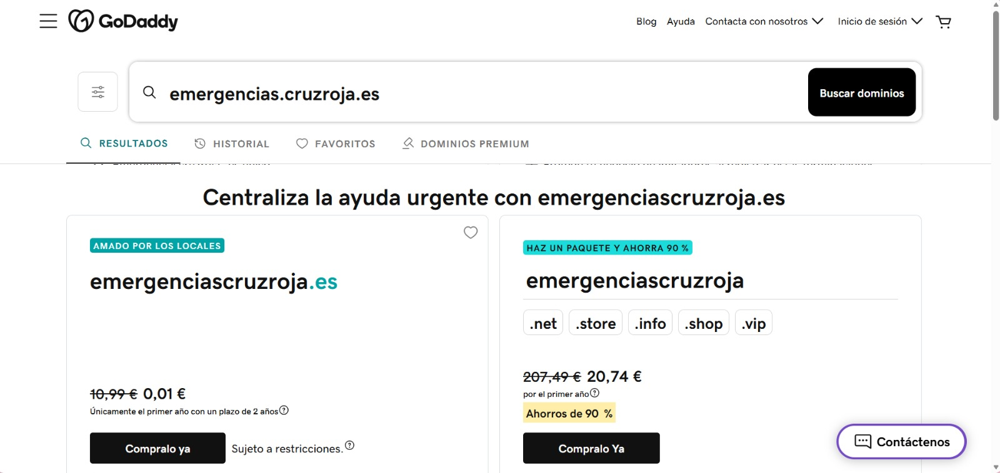
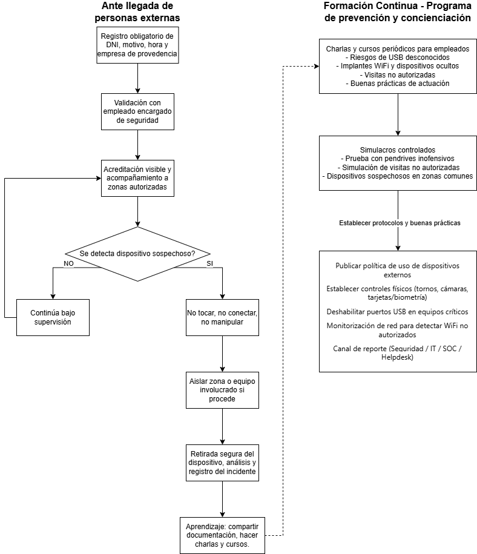

# Tarea: Ingeniería Social / PSYOPS

## 1.2 Phishing

### Guión / Storyline

El escenario simulado parte de una campaña de phishing dirigida al personal del Hospital General Acme. El atacante registra un dominio con apariencia oficial —como `emergencias.cruzroja.es`— disponible en registradores como GoDaddy, con el fin de suplantar la identidad de la Cruz Roja Española, una organización de máxima credibilidad en el ámbito sanitario.



El pretexto central es un supuesto brote de hantavirus, enfermedad zoonótica real con alto potencial de alarma pública. El objetivo es que el mayor número posible de empleados del hospital abra un archivo adjunto que simula contener protocolos oficiales de prevención emitidos por el Ministerio de Sanidad. La campaña explota tres palancas psicológicas fundamentales: **autoridad** (Cruz Roja y Ministerio de Sanidad), **urgencia** (alerta sanitaria activa) y **relevancia transversal** (el mensaje afecta a cualquier perfil del hospital, sin distinción de rol o departamento).

### Correo electrónico

```
De: comunicados@emergencias.cruzroja.es
Para: sergi.torres@hospitalgeneralacme.com
Asunto: Actualización urgente - Protocolos de prevención del hantavirus

Estimado Sergi:

El Ministerio de Sanidad ha alertado sobre un brote de casos y 
síntomas compatibles con hantavirus. Este virus se transmite de 
animales a personas por contacto con orina, heces, saliva o polvo 
contaminado de roedores infectados, especialmente en espacios 
cerrados o con poca ventilación.

Ante esta situación, es fundamental que todo el personal sanitario 
y no sanitario conozca y aplique las medidas preventivas 
establecidas. Su correcta implementación es esencial para 
garantizar la seguridad del personal, de los pacientes y de la 
comunidad.

Le compartimos las medidas oficiales de buenas prácticas 
establecidas por la Cruz Roja para la prevención del virus, así 
como los pasos que todo el personal deberá seguir para asegurar 
una respuesta segura y coordinada. Este comunicado es de 
obligatoria lectura, por lo que le solicitamos revisar el 
documento detenidamente y seguir los pasos indicados. Se 
realizarán revisiones para confirmar que cada área está aplicando 
correctamente este protocolo de prevención.

[ADJUNTO: Protocolos de prevención del hantavirus - Medidas y buenas prácticas]

Saludos cordiales,
Emergencias de Cruz Roja Española
```

### Efectividad de la campaña para cualquier tipo de usuario

La campaña no requiere conocimiento técnico previo por parte de la víctima para ejecutarse con éxito, lo que la hace válida para cualquier perfil del hospital. Su efectividad se apoya en tres factores clave: el adjunto se presenta como un documento oficial de uso habitual en entornos sanitarios, por lo que su apertura resulta natural; la alerta de hantavirus afecta a todos los departamentos sin excepción, eliminando la posibilidad de que el receptor lo perciba como algo ajeno a su función; y el dominio `emergencias.cruzroja.es` aporta una capa de legitimidad visual que dificulta su identificación como correo malicioso incluso para usuarios con cierta formación en seguridad.

## 1.3 Concienciación

### Procedimiento para frenar implantes WiFi y pendrives sospechosos en un banco

Para reducir el riesgo derivado de implantes WiFi, pendrives y otros dispositivos físicos no autorizados, se propone un procedimiento estructurado en tres líneas de defensa: control de acceso y visitas, protocolo de actuación ante dispositivos sospechosos, y formación continua del personal.

**Línea 1 — Control de acceso y visitas**

Toda visita externa debe registrarse en recepción indicando: DNI o documento de identidad, empresa de procedencia, motivo de la visita, persona de contacto interna y hora de entrada. La validación debe realizarse por el empleado anfitrión o por el responsable de seguridad física. Una vez autorizada la visita, el visitante deberá llevar acreditación visible y será acompañado en todo momento dentro de las zonas autorizadas.

**Línea 2 — Actuación ante dispositivos sospechosos**

Si un empleado detecta un pendrive, router WiFi, cargador manipulado, adaptador de red o cualquier dispositivo conectado sin autorización, se deberá aplicar la siguiente regla: **no tocar, no conectar, no manipular**. A continuación, el incidente debe reportarse inmediatamente a Seguridad Física, IT, SOC o Helpdesk. Si procede, se aislará la zona o el equipo afectado y se procederá a la retirada segura, análisis forense y registro del incidente.

**Línea 3 — Formación y simulacros**

El banco debe impartir charlas y píldoras formativas periódicas sobre los riesgos de USB desconocidos, implantes WiFi, visitas no autorizadas y buenas prácticas de actuación. Asimismo, se recomienda realizar simulacros controlados —como la colocación de pendrives inofensivos en zonas comunes o simulaciones de visitas no autorizadas— para evaluar el nivel de respuesta del personal y reforzar los procedimientos donde sea necesario.

### Esquema visual



### Lista de acciones a implementar

A continuación se presenta el conjunto de acciones prioritarias a incorporar en los procesos internos del banco:

1. Establecer un registro obligatorio de visitas externas con validación de identidad.
2. Definir zonas de acceso restringido y garantizar el acompañamiento permanente del visitante.
3. Publicar y comunicar a todo el personal la política de uso de dispositivos externos.
4. Instalar controles físicos: tornos, cámaras de seguridad y sistemas de acceso con tarjeta o biometría.
5. Deshabilitar los puertos USB en equipos críticos mediante configuración de sistemas o bloqueadores físicos.
6. Implantar monitorización de red para detectar puntos de acceso WiFi no reconocidos.
7. Establecer un canal claro y accesible de reporte de incidentes (Seguridad, IT, SOC o Helpdesk).
8. Realizar simulacros periódicos y sesiones de concienciación con seguimiento de resultados.

### Conclusión

La estrategia más robusta para hacer frente a esta tipología de amenaza combina controles físicos, medidas técnicas y formación continua del personal. La clave reside en que los empleados interioricen una regla sencilla y accionable ante cualquier dispositivo sospechoso: **no tocar, no conectar y reportar de inmediato**.

## 1.4 Deep Fake

Se adjunta imagen generada mediante herramientas de inteligencia artificial en la que se simula al profesor Igor Lukic al volante de un Ferrari descapotable.


## 1.5 Ingeniería Social: Ordenación por efectividad

A continuación se ordena, de mayor a menor efectividad, cada una de las técnicas de ingeniería social propuestas para el escenario de robo de contraseña a una víctima situada en la recepción de un hotel.

### Orden propuesto

1. **INSERTAR DISPOSITIVO USB**
2. **INSPECCIÓN VISUAL**
3. **PHISHING**
4. **VISHING**
5. **DEEPFAKE IA**

### Justificación

Se considera que la técnica más efectiva en este escenario concreto es **insertar un dispositivo USB**, dado que la recepción de un hotel es un entorno con alta afluencia de personas donde un atacante puede aproximarse físicamente con pretextos verosímiles: simular ser un cliente que necesita imprimir un documento, o hacerse pasar por soporte técnico alegando una actualización de sistemas, revisión del software interno o aplicación de nuevos protocolos. Al tratarse de un puesto orientado a la atención continua al cliente y con un ritmo elevado de solicitudes, este tipo de pretexto difícilmente genera sospechas en el personal.

En segundo lugar se sitúa la **inspección visual**, ya que el mostrador de recepción está permanentemente expuesto al público y puede permitir observar pantallas, teclado o información sensible con relativa facilidad. Basta con una justificación creíble para aproximarse lo suficiente y ejecutar la técnica, aunque su efectividad depende de que el personal exponga la contraseña al público o que dejen la iniciada sesión de usuario.

En tercer lugar se ubica el **phishing**, dado que recepción recibe habitualmente correos electrónicos sobre reservas, facturas o incidencias operativas, lo que facilita la creación de pretextos convincentes. Su efectividad está condicionada por los filtros de seguridad del correo corporativo y por el grado de concienciación del empleado.

A continuación se sitúa el **vishing**, pues una llamada telefónica puede resultar efectiva si simula provenir de soporte técnico, administración o un proveedor habitual. Sin embargo, requiere un guión más elaborado y existe una mayor probabilidad de que el empleado active protocolos de verificación internos, lo que reduce su tasa de éxito.

Por último se sitúa el **deepfake IA**, que, si bien representa una amenaza técnicamente avanzada y en crecimiento, requiere mayor preparación previa y conocimiento específico sobre el objetivo. Al tratarse de un vector poco convencional en los flujos de acceso habituales de un hotel, su efectividad relativa en este escenario concreto es la más baja de las cinco opciones evaluadas.
