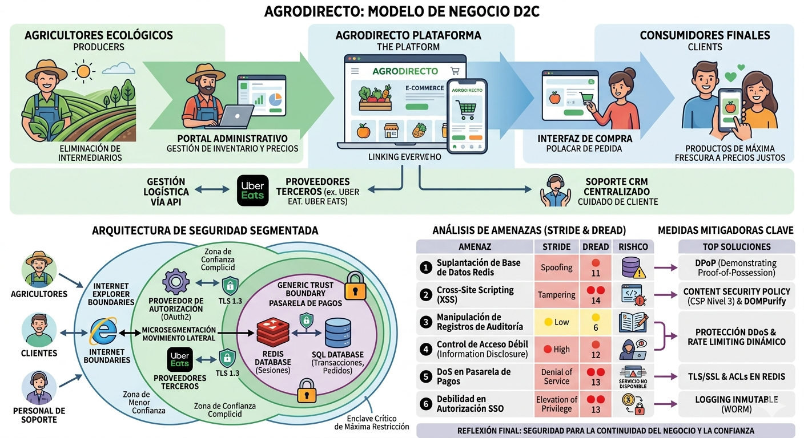

# 🔐 Modelado de Amenazas y Comprensión de Adversarios

## 1.1 Introducción

Este proyecto analiza la arquitectura de seguridad de **AgroDirecto**, una plataforma de comercio electrónico (e-commerce) especializada en conectar de forma directa a agricultores ecológicos con consumidores finales. El objetivo principal de la plataforma es eliminar intermediarios en la cadena de distribución para garantizar precios justos al productor y productos de máxima frescura al cliente final.

### Pilares de la Infraestructura

La infraestructura de AgroDirecto se organiza sobre un modelo **Direct-to-Consumer (D2C)** que integra tres pilares operacionales:

- **Gestión de Suministros:** Portal administrativo donde los agricultores controlan inventario, precios y disponibilidad de productos.
- **Venta y Logística:** Interfaz de cliente orientada a la compra, con integración vía API con proveedores de terceros (por ejemplo, Uber Eats) para la gestión de entregas.
- **Soporte:** Sistema CRM centralizado para la gestión de incidencias y la atención al cliente.

### Importancia de la Seguridad en el Contexto

Dada la naturaleza crítica de la disponibilidad en las operaciones agrícolas (para evitar el deterioro de productos perecederos) y la sensibilidad de los datos financieros gestionados, la seguridad y la resiliencia del sistema representan pilares arquitectónicos fundamentales. Un incidente de seguridad no solo afecta a la confidencialidad e integridad de los datos, sino que compromete la **disponibilidad** del servicio, con impacto directo en la cadena de suministro y en el modelo económico de los agricultores.

---

## 1.2 Diseño del Diagrama de Flujo de Datos (DFD)

El modelado de la arquitectura de AgroDirecto se apoya en un enfoque de **microsegmentación** que prioriza la disponibilidad del servicio y la protección de activos críticos. A través del análisis del flujo de datos del negocio, se han identificado los componentes, procesos, almacenes y límites de confianza que constituyen la superficie de ataque de la plataforma.

### Estrategia Arquitectónica: Principios Clave

La arquitectura propuesta implementa los siguientes principios de seguridad:

- **Separación Lógica de Portales:** Los accesos de usuarios y personal de soporte se segregan mediante portales independientes para limitar la exposición a través de la capa de presentación.
- **Resiliencia de la Operación Logística:** El sistema garantiza continuidad operativa en escenarios donde el e-commerce público se ve comprometido, protegiendo la entrega de productos.
- **Enclave Crítico de Seguridad:** La Pasarela de Pagos y la base de datos de transacciones financieras se aíslan dentro de una zona de máxima restricción, simulando una arquitectura de subred privada.
- **Prevención del Movimiento Lateral:** La implementación de límites de confianza explícitos impide la propagación de compromisos desde componentes de capa frontal hacia el enclave de procesamiento financiero.

### Referencia Visual: Diagrama Completo

### Especificación de Componentes

#### Entidades Externas (4)

Se definen **cuatro entidades externas** que simbolizan actores y sistemas fuera del perímetro organizacional:

1. **Agricultor:** Proveedor de contenido (productos) que utiliza el portal administrativo.
2. **Cliente Final:** Usuario consumidor que realiza operaciones de compra mediante la interfaz pública.
3. **Sistema de Soporte:** Entidad externa responsable de la atención al cliente.
4. **API de Logística Uber Eats:** Proveedor tercero integrado para la orquestación del servicio de entrega.

#### Procesos del Sistema (5)

Se especifican **cinco procesos críticos** que implementan la lógica de negocio:

1. **AgroDirecto Frontend:** Aplicación web/móvil que implementa la capa de presentación y validación de usuario.
2. **Proveedor de Autorización:** Servicio centralizado de gestión de identidad basado en OAuth2 y SSO.
3. **AgroDirecto CRM:** Sistema de gestión de relaciones con clientes y seguimiento de incidencias.
4. **Pasarela de Pagos:** Componente especializado de procesamiento de transacciones financieras.
5. **AgroDirecto Backend:** Servicio de orquestación de lógica de negocio y coordinación de flujos de datos.

#### Almacenes de Datos (3)

Se definen **tres almacenes de datos** categorizados por su función operacional:

1. **Redis Database:** Servicio de caché en memoria para la gestión de sesiones y datos de acceso frecuente.
2. **SQL Database:** Base de datos persistente con información de perfiles, pedidos e historial de transacciones.
3. **File System:** Sistema de almacenamiento para registros de auditoría, documentación y contenido estático.

#### Flujos de Comunicación Asegurados

La totalidad de flujos entre componentes se implementan mediante canales HTTPS cifrados con TLS 1.3, garantizando confidencialidad e integridad en tránsito de datos.

### Límites de Confianza (Trust Boundaries)

La arquitectura establece **tres zonas de confianza independientes** que implementan segregación de responsabilidades:

- **Internet Explorer Boundaries:** Fronteras que marcan la transición de usuarios externos (agricultores, clientes y personal de soporte) hacia el perímetro de la aplicación.
- **Complicit Trust Boundary:** Zona controlada que alberga el proveedor de autorización e integraciones con terceros, limitando la exposición de credenciales.
- **Generic Trust Boundary:** Enclave de máxima restricción que contiene Pasarela de Pagos, Redis y SQL Database, implementando microsegmentación que impide el movimiento lateral desde capas frontales.

---

## 1.3 Identificación y Análisis de Amenazas

### Metodología Aplicada

El análisis de amenazas de AgroDirecto se basa en el método **STRIDE** (Spoofing, Tampering, Repudiation, Information Disclosure, Denial of Service, Elevation of Privilege), una metodología estándar en la industria para el análisis de riesgos en sistemas. Mediante la herramienta profesional **Microsoft Threat Modeling Tool**, se realizó un modelado exhaustivo de la arquitectura que resultó en la identificación de **281 amenazas potenciales**.

De este conjunto de amenazas, se han seleccionado las **6 amenazas más críticas** para un análisis en profundidad, aplicando criterios de impacto en el modelo de negocio, probabilidad de explotación y criticidad de los componentes afectados.

**Nota:** El mapeo completo de técnicas MITRE ATT&CK con anotaciones detalladas se encuentra disponible en el archivo `agrodirecto_attack_navigator.json`, que utiliza el formato estándar de capas de Attack Navigator para la visualización de técnicas de ataque en el contexto del sistema.

### Evaluación de Riesgo mediante DREAD

Se ha aplicado el framework **DREAD** para cuantificar el riesgo relativo de cada amenaza seleccionada:

- **D (Damage Potential):** Magnitud del daño potencial (1=Mínimo, 2=Moderado, 3=Total).
- **R (Reproducibility):** Facilidad para reproducir el ataque (1=Muy difícil, 2=Mediano, 3=Trivial).
- **E (Exploitability):** Facilidad técnica para explotar la vulnerabilidad (1=Requiere conocimiento avanzado, 2=Técnica intermedia, 3=Trivial).
- **A (Affected Users):** Número y proporción de usuarios impactados (1=Pocos, 2=Significativo, 3=Todos/Muchos).
- **D (Discoverability):** Facilidad para descubrir la vulnerabilidad (1=Extremadamente difícil, 2=Difícil, 3=Trivial/Pública).

La puntuación total de riesgo se calcula como suma de estos cinco factores, alcanzando un máximo de 15 puntos.

### Amenazas Seleccionadas para Análisis

De las 281 amenazas identificadas por Microsoft Threat Modeling Tool, se han seleccionado las siguientes **seis amenazas de máxima prioridad**:

1. **Suplantación de Base de Datos Redis** [ID 17 - STRIDE: Spoofing]
2. **Cross-Site Scripting (XSS)** [ID 1 - STRIDE: Tampering]
3. **Manipulación de Registros de Auditoría** [ID 249 - STRIDE: Repudiation]
4. **Control de Acceso Débil a Recursos Críticos** [ID 18 - STRIDE: Information Disclosure]
5. **Denegación de Servicio en Pasarela de Pagos** [ID 73 - STRIDE: Denial of Service]
6. **Debilidad en Autorización SSO** [ID 11 - STRIDE: Elevation of Privilege]

### Matriz Cuantitativa DREAD

| Amenaza                       | D   | R   | E   | A   | D   | **Total/15** | **Nivel**    |
| ----------------------------- | --- | --- | --- | --- | --- | ------------ | ------------ |
| **1. Suplantación Redis**     | 3   | 2   | 2   | 3   | 1   | **11**       | 🔴 Alto      |
| **2. Cross-Site Scripting**   | 2   | 3   | 3   | 3   | 3   | **14**       | 🔴🔴 Crítico |
| **3. Manipulación Auditoría** | 1   | 1   | 1   | 2   | 1   | **6**        | 🟡 Bajo      |
| **4. Control Acceso Débil**   | 3   | 2   | 2   | 3   | 2   | **12**       | 🔴 Alto      |
| **5. DoS Pagos**              | 3   | 3   | 2   | 3   | 2   | **13**       | 🔴🔴 Crítico |
| **6. Debilidad SSO**          | 3   | 2   | 3   | 3   | 2   | **13**       | 🔴🔴 Crítico |

---

### Amenaza 1: Suplantación de Base de Datos Redis

**ID:** 17 | **Categoría STRIDE:** Spoofing | **Severidad:** 🔴 Alto | **DREAD:** 11/15

**Descripción Técnica:**  
Un atacante en posición de intermediario de red podría suplantar la identidad de la base de datos Redis, provocando la interceptación y modificación de datos transaccionales en tránsito. Esta vulnerabilidad corresponde a MITRE ATT&CK técnica T1557 (Adversary-in-the-Middle), que describe la capacidad de interceptar comunicaciones sin cifrar o con autenticación deficiente.

**Componentes del Sistema Afectados:**

- Base de Datos Redis (almacenamiento de caché)
- Pasarela de Pagos (consumidor de datos de Redis)

**Impacto Empresarial:**
La suplantación de Redis podría comprometer la integridad de sesiones de usuario y datos de transacciones financieras, resultando en pérdida de confianza de los agricultores, alteración de registros de ventas y posible incumplimiento de normativas PCI-DSS.

**Estado del Riesgo:** ✅ **Mitigado**  
**Fundamentación de Mitigación:** Este riesgo se ha neutralizado mediante la implementación de una arquitectura de Zero Trust que establece zonas de confianza diferenciadas. La base de datos Redis se encuentra aislada en un enclave seguro con acceso restringido exclusivamente a procesos autorizados, impidiendo la suplantación incluso en escenarios de compromiso de red.

---

### Amenaza 2: Cross-Site Scripting (XSS)

**ID:** 1 | **Categoría STRIDE:** Tampering | **Severidad:** 🔴 **Crítico** | **DREAD:** 14/15

**Descripción Técnica:**  
La aplicación web (AgroDirecto Frontend) es susceptible a ataques de inyección de código JavaScript malicioso en el contexto del navegador del cliente, resultado de una validación insuficiente de entradas de usuario. Esta vulnerabilidad se alinea con MITRE ATT&CK técnica T1059 (Command and Scripting Interpreter), permitiendo la ejecución arbitraria de scripts en el contexto de la sesión del usuario.

**Componentes del Sistema Afectados:**

- AgroDirecto Frontend (aplicación web/móvil)
- Sesiones de usuarios autenticados
- Datos de navegación del cliente

**Impacto Empresarial:**
Un atacante podría capturar tokens de sesión de agricultores o clientes, robar credenciales, redirigir a pasarelas de pago fraudulentas o modificar información de pedidos. El impacto directo sería la erosión de la confianza en la plataforma, la exposición a responsabilidad legal por violación de RGPD y privacidad, y la pérdida económica de los usuarios.

**Estado del Riesgo:** ⏳ **Parcialmente Mitigado**  
**Fundamentación de Mitigación:** Aunque se ha implementado un WAF (Web Application Firewall) como línea defensiva perimetral para detener payloads XSS conocidos, esta solución es incompleta debido a técnicas de evasión. Una corrección completa requeriría refactorización del código frontend y backend para sanitización de inputs en origen.

---

### Amenaza 3: Manipulación de Registros de Auditoría

**ID:** 249 | **Categoría STRIDE:** Repudiation | **Severidad:** 🟡 **Bajo** | **DREAD:** 6/15

**Descripción Técnica:**  
Entidades con bajo nivel de confianza podrían modificar, eliminar o falsificar registros de auditoría del sistema, imposibilitando la reconstrucción forense de eventos. Esta vulnerabilidad corresponde a MITRE ATT&CK técnica T1070 (Indicator Removal on Host), que describe la manipulación de evidencia digital para eludir responsabilidad.

**Componentes del Sistema Afectados:**

- Registros de auditoría del sistema (logs)
- Pasarela de Pagos (auditoría de transacciones)
- Base de Datos Redis (auditoría de acceso)

**Impacto Empresarial:**
La imposibilidad de realizar auditorías forenses fiables después de un incidente de seguridad deja a la organización en una posición vulnerable ante: (a) disputas financieras con clientes, (b) incumplimiento de normativas de retención de registros (RGPD, SOX), (c) incapacidad de detectar patrones de fraude repetitivos y (d) responsabilidad legal agravada.

**Estado del Riesgo:** ✅ **Mitigado**  
**Fundamentación de Mitigación:** Se ha implementado una arquitectura de Zero Trust con enclave restringido que limita el acceso a escritura de logs exclusivamente a componentes de alta confianza (Pasarela de Pagos, Backend). Esta segregación reduce el riesgo de manipulación a escenarios donde el propio backend está comprometido, un vector de ataque de complejidad muy elevada.

---

### Amenaza 4: Control de Acceso Débil a Recursos Críticos

**ID:** 18 | **Categoría STRIDE:** Information Disclosure | **Severidad:** 🔴 **Alto** | **DREAD:** 12/15

**Descripción Técnica:**  
La base de datos Redis, que alberga datos sensibles de sesiones y transacciones, podría ser accesible a través de credenciales débiles o sin autenticación, permitiendo a un atacante leer información confidencial en la memoria. Esta vulnerabilidad se corresponde con MITRE ATT&CK técnica T1560 (Archive Collected Data) y T1041 (Exfiltration Over C2 Channel).

**Componentes del Sistema Afectados:**

- Base de Datos Redis
- Datos de sesiones de usuario
- Información de inventario de productos
- Registros de transacciones

**Impacto Empresarial:**
La exfiltración de datos sensibles resultaría en: (a) violación de privacidad de datos personales de usuarios (RGPD), (b) exposición de información competitiva (precios, volúmenes de ventas), (c) robo de credenciales que facilita escalación de privilegios, y (d) daño reputacional irreversible.

**Estado del Riesgo:** ✅ **Mitigado**  
**Fundamentación de Mitigación:** Se han implementado zonas de confianza mediante segmentación de red que aísla Redis dentro de un enclave de máxima restricción. El acceso es exclusivamente a través de procesos autorizados (Pasarela de Pagos, Backend) con autenticación de cliente mediante certificados X.509, y se han habilitado ACLs a nivel de Redis 6.0+.

---

### Amenaza 5: Denegación de Servicio en Pasarela de Pagos

**ID:** 73 | **Categoría STRIDE:** Denial of Service | **Severidad:** 🔴 **Crítico** | **DREAD:** 13/15

**Descripción Técnica:**  
La Pasarela de Pagos podría saturarse y detenerse su operación cuando enfrenta picos de tráfico no esperados, ya sea mediante ataques DDoS deliberados o cargas legítimas no previstas. Esta vulnerabilidad corresponde a MITRE ATT&CK técnica T1498 (Network Denial of Service), que describe ataques de consumo de recursos a nivel de aplicación.

**Componentes del Sistema Afectados:**

- Pasarela de Pagos (proceso crítico)
- Infraestructura de cómputo (servidores web)
- Capacidad de procesamiento agregada

**Impacto Empresarial:**
Dado que AgroDirecto maneja productos perecederos con ciclos de venta de 24-72 horas, una caída de la Pasarela de Pagos genera un impacto en cascada: (a) detención de la venta de productos, (b) deterioro de mercancía no vendida, (c) pérdida económica directa para agricultores, (d) erosión irreversible de la confianza en la plataforma y (e) ventaja competitiva comprometida frente a competidores.

**Estado del Riesgo:** ⏳ **No Iniciado**  
**Fundamentación de Mitigación:** Aunque la infraestructura actual incluye rate limiting básico en servidor, se carece de escalado dinámico debido a restricciones presupuestarias. La corrección requeriría inversión en infraestructura elástica (grupos de auto-escalado) y servicios de protección DDoS, con proyección de implementación en la próxima fase de desarrollo.

---

### Amenaza 6: Debilidad en Autorización SSO

**ID:** 11 | **Categoría STRIDE:** Elevation of Privilege | **Severidad:** 🔴 **Crítico** | **DREAD:** 13/15

**Descripción Técnica:**  
Las implementaciones de OAuth2 y Single Sign-On (SSO) en AgroDirecto son vulnerables a ataques de interceptación y reutilización de tokens de acceso. Un atacante podría capturar un token durante su tránsito en red no cifrada, en memoria del cliente, o mediante inyección de código XSS, y posteriormente reutilizarlo para ganar acceso no autorizado. Esta vulnerabilidad corresponde a MITRE ATT&CK técnica T1550 (Use Alternate Authentication Material).

**Componentes del Sistema Afectados:**

- AgroDirecto Frontend (módulo de autenticación)
- Proveedor de Autorización (servicio OAuth2)
- Todos los servicios integrados mediante tokens SSO

**Impacto Empresarial:**
Un atacante en posesión de un token robado podría: (a) suplantar la identidad de un usuario legítimo, (b) obtener privilegios administrativos si el token es de un administrador, (c) manipular precios globales de productos, (d) acceder a estados financieros y reportes de ventas, y (e) realizar transacciones fraudulentas. Este escenario representa el riesgo máximo de compromiso de confidencialidad y integridad.

**Estado del Riesgo:** ⏳ **No Iniciado**  
**Fundamentación de Mitigación:** La corrección requeriría implementar OAuth2 con extensión DPoP (RFC 9449), que vincula criptográficamente cada token a la clave privada del cliente, imposibilitando su reutilización desde otro contexto. Adicionalmente, se requeriría rotación automática de tokens con TTL muy cortos (15 minutos). Este trabajo está actualmente en fase de especificación de requisitos.

---

## 1.4 Propuesta de Medidas Mitigadoras

A partir del análisis STRIDE y DREAD previamente realizado, se presenta un conjunto de medidas mitigadoras técnicas y procedimentales diseñadas específicamente para reducir el riesgo residual de las seis amenazas críticas identificadas. Cada medida se ha evaluado considerando su factibilidad técnica, coste de implementación y alineamiento con la arquitectura existente de AgroDirecto, procurando proporcionar soluciones realistas y alcanzables dentro de un horizonte temporal de 3-6 meses.

### Matriz de Mitigaciones Propuestas por Amenaza

| ID      | Amenaza                                         | Medida de Mitigación                                                                                                                                                                                                                                                                                                                                                        | Tipo          | Fundamentación                                                                                                                                                                                                                                                                            |
| ------- | ----------------------------------------------- | --------------------------------------------------------------------------------------------------------------------------------------------------------------------------------------------------------------------------------------------------------------------------------------------------------------------------------------------------------------------------- | ------------- | ----------------------------------------------------------------------------------------------------------------------------------------------------------------------------------------------------------------------------------------------------------------------------------------- |
| **17**  | **Suplantación de Base de Datos Redis**         | Implementar **TLS/SSL para conexiones Redis** con autenticación de cliente mediante certificados X.509. Además, habilitar **ACLs (Access Control Lists) nativas de Redis 6.0+** para restringir operaciones por rol.                                                                                                                                                        | Técnica       | Elimina la posibilidad de acceso no autenticado y la modificación de datos en tránsito. Los certificados digitales vinculan la identidad del cliente a su clave privada, imposibilitando la suplantación incluso si el atacante captura el tráfico.                                       |
| **1**   | **Cross Site Scripting (XSS)**                  | Implementación de una **Content Security Policy (CSP) de nivel 3** con directivas `script-src 'self'` y desinfectado (sanitization) de todos los inputs en el backend mediante librerías como **DOMPurify** o **OWASP Java Encoder**.                                                                                                                                       | Técnica       | Aunque el WAF actual filtra ataques conocidos, una CSP estricta previene la ejecución no autorizada de scripts inline, eliminando el riesgo residual incluso ante evasión de WAF. La sanitización en backend garantiza que los datos almacenados nunca contengan código malicioso.        |
| **249** | **Manipulación de Registros de Auditoría**      | Configurar un sistema de **logging inmutable** mediante un SIEM on-premise (por ejemplo, **ELK Stack** o **Graylog**) con retención extendida (>1 año) y almacenamiento en un repositorio WORM (Write Once Read Many) local o NAS con protección contra borrado. Implementar **firmas digitales HMAC-SHA256** en cada entrada de log.                                       | Procedimental | Crea una pista de auditoría criptográficamente vinculada a una timeline interna, imposibilitando alteraciones retroactivas. Cumple con requisitos de trazabilidad forense y puede usarse como evidencia en litigios.                                                                      |
| **18**  | **Control de Acceso Débil a Recursos Críticos** | Aplicar el **Principio de Menor Privilegio (PoLP)** mediante **controles de acceso basados en roles (RBAC)** en el sistema operativo y firewall, limitando el acceso a Redis solo a procesos y usuarios específicos. Implementar **Redis Sentinel** para failover automático y **cifrado en reposo** usando LUKS o BitLocker.                                               | Técnica       | Segmenta el acceso de modo que solo la Pasarela de Pagos y el Backend pueden leer y escribir en Redis. Incluso si un atacante compromete una aplicación cliente, no podrá acceder a datos de otros segmentos. El cifrado en reposo protege contra el acceso físico al almacenamiento.     |
| **73**  | **Denegación de Servicio en Pasarela de Pagos** | Desplegar **clúster de servidores físicos o virtuales** con balanceador de carga (por ejemplo, **HAProxy** o **NGINX**) configurado para escalar horizontalmente entre 2-10 instancias según CPU/red. Implementar **firewall perimetral con reglas anti-DDoS** y configurar **rate limiting dinámico** con límites por IP cliente (ej. 100 req/min por sesión autenticada). | Técnica       | El escalado automático absorbe picos de tráfico legítimos e ilegítimos, manteniendo la disponibilidad. El firewall perimetral y el balanceador de carga proporcionan protección DDoS de capa 3/4. El rate limiting frena ataques de fuerza bruta sin ser agresivo con usuarios legítimos. |
| **11**  | **Debilidad en Autorización SSO**               | Implementar **OAuth 2.0 con DPoP (Demonstrating Proof-of-Possession)** según RFC 9449, donde cada token de acceso está criptográficamente ligado a la clave privada del cliente. Añadir **rotación automática de tokens** (TTL=15min) y **refresh token binding**.                                                                                                          | Técnica       | DPoP imposibilita reutilizar tokens interceptados desde otro cliente, pues el atacante carecería de la clave privada para firmar las peticiones. La rotación de tokens reduce la ventana de exposición en caso de compromiso. Cumple con estándares OWASP y NIST.                         |

### Principios de Diseño de Mitigaciones

El enfoque propuesto se fundamenta en los siguientes principios estratégicos:

1. **Prioridad en Mitigaciones Técnicas sobre Compensatorias:** Se ha privilegiado el remedio en origen (eliminación de vulnerabilidades) sobre medidas de detección y respuesta, bajo el supuesto de que AgroDirecto posee capacidad técnica y presupuestaria para implementar cambios arquitectónicos.

2. **Alineamiento con Zero Trust:** Las mitigaciones refuerzan una arquitectura de Zero Trust explícita, donde cada componente requiere autenticación y autorización granular, sin confiar en perímetros únicos.

3. **Escalado Temporal Realista:** Cada medida se ha acotado a ser implementable en un horizonte de 3-6 meses sin introducir interrupciones operacionales críticas.

4. **Proporcionalidad Riesgo-Coste:** Se han priorizado las seis amenazas según su puntuación DREAD, enfocándose primero en XSS (DREAD 14/15) y DoS (DREAD 13/15), que afectan la continuidad del negocio.

---

## 1.5 Reflexión Final y Análisis del Riesgo

Este análisis permite trasladar conceptos teóricos a un escenario creíble de negocio, donde la seguridad no se limita a proteger activos técnicos, sino que también condiciona la continuidad del servicio, la confianza del usuario y la sostenibilidad operativa de la plataforma.

### Principales Riesgos Detectados

Del universo de **281 amenazas identificadas**, las seis priorizadas muestran un panorama de riesgos con impacto técnico y empresarial claro. El riesgo más crítico, con **DREAD 14/15**, es el **Cross-Site Scripting (XSS)** en el frontend, por su capacidad para comprometer sesiones y facilitar el robo de credenciales o redirecciones fraudulentas. Le siguen la **denegación de servicio en la pasarela de pagos** y la **debilidad en la autorización SSO**, ambas con **13/15**, por su potencial para interrumpir operaciones o permitir accesos indebidos.

Estos riesgos, además, pueden encadenarse. Un XSS inicial podría facilitar el compromiso de tokens de sesión y agravar el impacto sobre otros componentes sensibles. También destacan el **control de acceso débil** sobre Redis (**12/15**) y la **suplantación de bases de datos** (**11/15**) por su efecto sobre la confidencialidad e integridad de la información, mientras que la **manipulación de registros de auditoría** (**6/15**) sigue siendo relevante por su impacto en trazabilidad y cumplimiento.

### Elementos Críticos de la Arquitectura

La arquitectura de AgroDirecto se apoya en una **microsegmentación con zonas de confianza diferenciadas**, lo que refuerza la defensa en profundidad. Entre los elementos más críticos destacan la **pasarela de pagos**, aislada en un enclave de máxima restricción por su impacto directo en la operativa del negocio; la **base de datos Redis** y la **SQL Database**, por almacenar información sensible; y el **proveedor de autorización**, por concentrar funciones de identidad y acceso.

El **frontend** también representa un punto expuesto por su interacción directa con el usuario. A esto se suma la dependencia de servicios de terceros, como la API logística. En este contexto, la **disponibilidad** resulta clave, ya que una caída prolongada podría traducirse en pérdidas económicas inmediatas y fallos en la cadena de suministro.

### Límites del Análisis Realizado y Posibles Mejoras

Este análisis, aunque útil en su aplicación de **STRIDE** y **DREAD**, tiene límites propios de un modelado estático basado en un DFD. No cubre con el mismo nivel de detalle riesgos dinámicos, como vulnerabilidades en dependencias, ingeniería social o la capacidad real de detección y respuesta ante incidentes.

Como mejora, sería recomendable complementar este trabajo con **penetration testing**, ejercicios de **red teaming**, revisión de dependencias mediante **SBOM** y una evaluación más específica de riesgos asociados a terceros. También sería útil incorporar un proceso continuo de **threat intelligence** para adaptar el análisis a la evolución del entorno de amenazas y ajustar la infraestructura de forma proactiva. Estas mejoras no solo reducirían la superficie de ataque, sino que también alinearían AgroDirecto con estándares como **NIST** y **OWASP**.

### Conclusiones Finales

En conjunto, el documento constituye una base útil para entender la exposición de AgroDirecto y priorizar medidas de mejora. Más allá del plano técnico, el trabajo refleja que la seguridad de la plataforma afecta de forma directa a quienes dependen de ella, por lo que el modelado de amenazas debe entenderse como una herramienta práctica para razonar riesgos y tomar decisiones con criterio.
