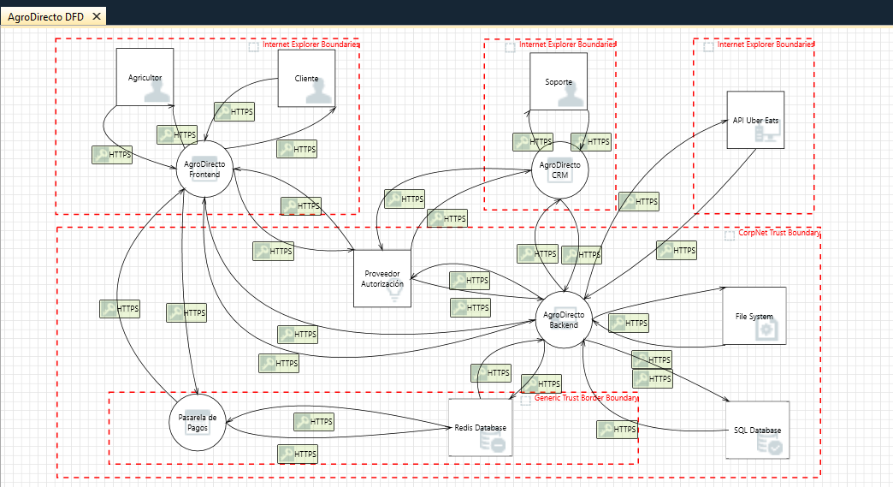

# 🔐 Modelado de Amenazas y Comprensión de Adversarios

## 1.1 Introducción

**AgroDirecto** es una plataforma tecnológica diseñada para conectar de forma directa a agricultores ecológicos con el consumidor final. El objetivo principal es eliminar intermediarios para garantizar precios justos al productor y productos de máxima frescura al cliente.

### Pilares de la Infraestructura

La infraestructura se basa en un modelo **Direct-to-Consumer** que integra:

- **Gestión de Suministros:** Portal para que los agricultores controlen stock y precios
- **Venta y Logística:** Interfaz de compra para clientes e integración vía API con servicios de terceros (ej. Uber Eats) para la entrega
- **Soporte:** Un sistema CRM para la gestión de incidencias y atención al cliente

### Importancia de la Seguridad

Dada la naturaleza crítica de la disponibilidad para evitar el deterioro de productos perecederos, y la sensibilidad de los datos financieros manejados, **la seguridad y la resiliencia del sistema son pilares fundamentales** de su diseño.

---

## 1.2 Diseño del Diagrama de Flujo de Datos (DFD)

Para el diseño de la infraestructura de AgroDirecto, se ha optado por un modelo de **microsegmentación** que prioriza la disponibilidad y la protección de activos críticos. 

### Características Clave del Modelo

- **Separación Lógica:** El acceso de agricultores y clientes se realiza mediante portales independientes para reducir la superficie de exposición
- **Continuidad Operativa:** Garantiza la operativa logística incluso ante incidentes en el e-commerce público
- **Enclave de Seguridad:** El núcleo del sistema (Pasarela de Pagos y Base de Datos Financiera) se aisla en una zona restringida simulando una subred privada
- **Protección Transacional:** Impide el movimiento lateral y protege la integridad de las transacciones económicas frente a posibles compromisos en las capas frontales

### Diagrama de Referencia

### Componentes del Sistema

#### Entidades Externas (4)
El diagrama incluye **4 entidades externas** que interactúan con el sistema:

1. **Agricultor:** Principal generador de contenido y proveedor de productos
2. **Cliente:** Consumidor final que realiza compras a través de la plataforma
3. **Soporte:** Sistema de atención al cliente externo
4. **API Uber Eats:** Proveedor tercero integrado para servicios de logística y entrega

#### Procesos (4)
Se identifica **5 procesos críticos** que metabolizan las transacciones:

1. **AgroDirecto Frontend:** Portal web/móvil para interacción de usuarios
2. **Proveedor Autorización:** Servicio OAuth2/SSO para autenticación centralizada
3. **AgroDirecto CRM:** Sistema de gestión de relaciones y atención al cliente
4. **Pasarela de Pagos:** Procesador de transacciones financieras
5. **AgroDirecto Backend:** Orquestador central de lógica de negocio

#### Almacenes de Datos (3)
Se preservan **3 almacenes de datos** diferenciados por criticidad:

1. **Redis Database:** Caché de sesiones y datos transaccionales
2. **SQL Database:** Base de datos productiva con información de pedidos, usuarios y financiera
3. **File System:** Sistema de archivos para logs, documentos y contenido estático

#### Flujos de Datos
Todos los componentes se comunican mediante **flujos HTTPS** asegurados, garantizando confidencialidad e integridad en tránsito.

### Límites de Confianza (Trust Boundaries)

La arquitectura implementa **3 zonas de confianza diferenciadas**:

- **Internet Explorer Boundaries:** Separan la interacción de usuarios externos (agricultores, clientes, soporte) del perímetro de la aplicación
- **Complicit Trust Boundary:** Aisla el procesador de autorización y servicios terceros en un segmento controlado
- **Generic Trust Boundary:** Enclave de seguridad que protege la pasarela de pagos, Redis y SQL Database, impidiendo movimiento lateral desde las capas frontales

---

## 1.3 Identificación de Amenazas (Metodología STRIDE)

### Análisis

Tras el modelado exhaustivo con la herramienta **Microsoft Threat Modeling Tool**, se han detectado **281 amenazas potenciales**. Siguiendo el criterio de criticidad y relevancia para el modelo de negocio de AgroDirecto, se han seleccionado las siguientes **6 amenazas de prioridad Alta** extraídas directamente del reporte:

---

### Amenaza 1: Suplantación de Base de Datos Redis

**ID:** 17 | **Categoría:** Spoofing | **Severidad:** 🔴 Alta

**Descripción Técnica:**  
Un atacante podría suplantar la base de datos Redis, provocando la entrega de datos manipulados a la Pasarela de Pagos. Según MITRE ATT&CK (T1557), esto permite interceptar flujos críticos mediante técnicas de Adversary-in-the-Middle.

**Componentes Afectados:**
- Redis Database
- Pasarela de Pagos

**Impacto en el Negocio:**  
Compromiso de la integridad en las transacciones financieras y posible alteración de los registros de ventas de los agricultores.

**Estado:** ✅ Mitigated (Mitigado)  
**Justificación:** Este riesgo se considera neutralizado tras la implementación de una validación estricta de tokens de sesión y la creación de zonas de confianza que aseguran que no se puede acceder a los recursos sin el rol y los permisos adecuados.

---

### Amenaza 2: Cross Site Scripting (XSS)

**ID:** 1 | **Categoría:** Tampering | **Severidad:** 🔴 Alta

**Descripción Técnica:**  
El servidor web es susceptible a ataques de scripts cruzados al no sanear adecuadamente las entradas de usuarios. Se asocia con MITRE ATT&CK (T1059) para la ejecución de código malicioso en el navegador del cliente.

**Componentes Afectados:**
- AgroDirecto Frontend

**Impacto en el Negocio:**  
Robo de sesiones de clientes o redirección a pasarelas de pago fraudulentas, afectando directamente la reputación de la plataforma.

**Estado:** ⏳ Not Started (No iniciado)  
**Justificación:** La corrección definitiva requiere una refactorización del código fuente. No obstante, dada la necesidad de mantener la operatividad, se ha optado por una mitigación perimetral mediante la implementación de un **WAF (Web Application Firewall)** como barrera inmediata.

---

### Amenaza 3: Manipulación de Registros de Auditoría

**ID:** 249 | **Categoría:** Repudiation | **Severidad:** 🔴 Alta

**Descripción Técnica:**  
Permitir que entidades con bajos niveles de confianza escriban en los registros de auditoría genera problemas de repudio. Se vincula con MITRE ATT&CK (T1070) sobre la manipulación de indicadores de actividad.

**Componentes Afectados:**
- Logs del Sistema
- Pasarela de Pagos
- Redis Database

**Impacto en el Negocio:**  
Imposibilidad de realizar auditorías forenses fiables tras un incidente, dejando a la empresa legalmente vulnerable ante disputas financieras.

**Estado:** ✅ Not Applicable (No aplicable)  
**Justificación:** Se ha implementado una subred con arquitectura **Zero Trust** para evitar estos escenarios. En esta subred solo tienen acceso el servicio de pasarela de pagos y la base de datos de Redis, restringiendo el origen de los logs a componentes de alta confianza.

---

### Amenaza 4: Control de Acceso Débil a Resources Críticos

**ID:** 18 | **Categoría:** Information Disclosure | **Severidad:** 🔴 Alta

**Descripción Técnica:**  
Una protección de datos inadecuada en Redis podría permitir que un atacante lea información confidencial. Se relaciona con MITRE ATT&CK (T1560) para la recolección de activos de datos del negocio.

**Componentes Afectados:**
- Redis Database

**Impacto en el Negocio:**  
Filtración de pedidos, volúmenes de stock y datos personales, incumpliendo normativas de privacidad como el **RGPD**.

**Estado:** ✅ Mitigated (Mitigado)  
**Justificación:** Se han implementado zonas de confianza en subredes con una arquitectura **Zero Trust** que mitiga esta vulnerabilidad mediante el aislamiento de la base de datos de los segmentos de red públicos.

---

### Amenaza 5: Denegación de Servicio en Pasarela de Pagos

**ID:** 73 | **Categoría:** Denial of Service | **Severidad:** 🔴 Alta

**Descripción Técnica:**  
El proceso de pagos puede detenerse o degradar su rendimiento ante picos de carga. Se asocia con MITRE ATT&CK (T1498) por agotamiento de recursos del sistema.

**Componentes Afectados:**
- Pasarela de Pagos

**Impacto en el Negocio:**  
La caída del servicio detiene la venta de productos perecederos, provocando pérdidas económicas directas a los agricultores por desperdicio de mercancía.

**Estado:** ⏳ Not Started (No iniciado)  
**Justificación:** El despliegue de una infraestructura de escalado dinámico no se ha completado por falta de presupuesto. Actualmente, la defensa se limita a la configuración de límites de tasa (**rate-limiting**) en el servidor.

---

### Amenaza 6: Debilidad en Autorización SSO

**ID:** 11 | **Categoría:** Elevation of Privilege | **Severidad:** 🔴 Alta

**Descripción Técnica:**  
Las implementaciones de SSO como OAuth2 son vulnerables a ataques de interceptación. Según MITRE ATT&CK (T1550), esto facilita el uso de tokens capturados para ganar acceso no autorizado.

**Componentes Afectados:**
- AgroDirecto Frontend (Módulo de Autenticación)
- Servicios integrados mediante OAuth2

**Impacto en el Negocio:**  
Un atacante podría obtener privilegios de administrador, permitiendo la manipulación de precios globales o el acceso a la facturación de toda la plataforma.

**Estado:** ⏳ Not Started (No iniciado)  
**Justificación:** Se ha movido al backlog la implementación de **DPoP (Demonstrating Proof-of-Possession)** para ligar los tokens criptográficamente al cliente. El estado se mantiene en investigación mientras se definen los parámetros técnicos.